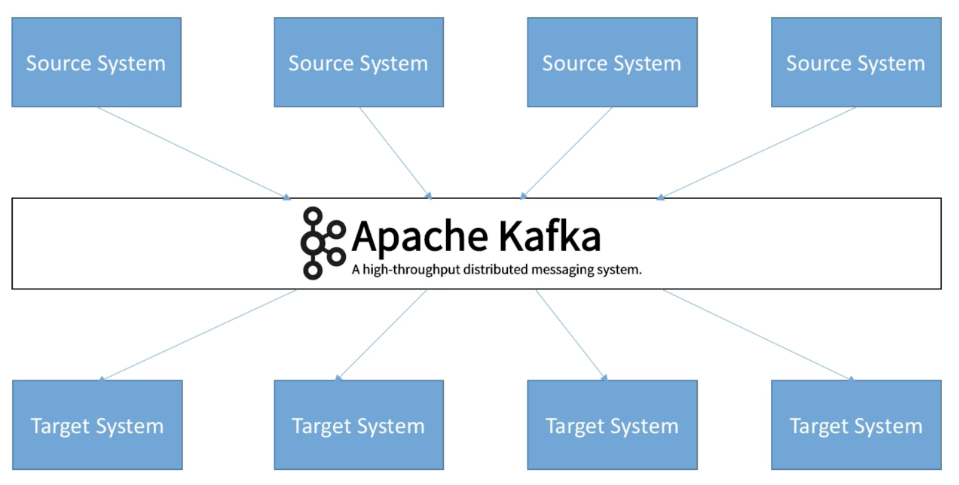
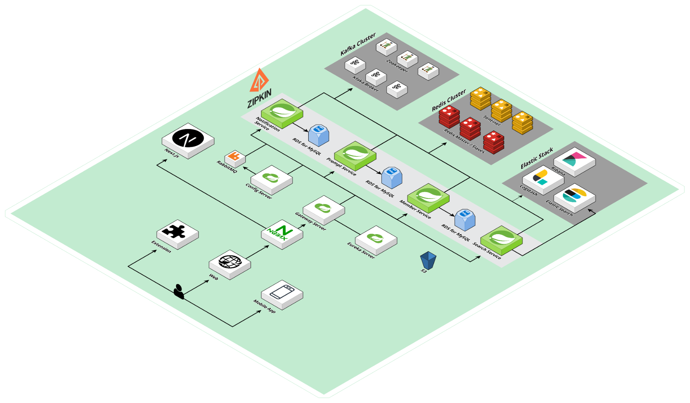
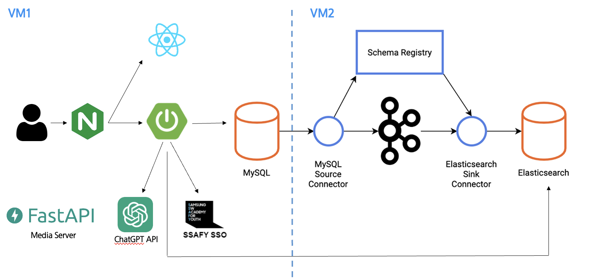
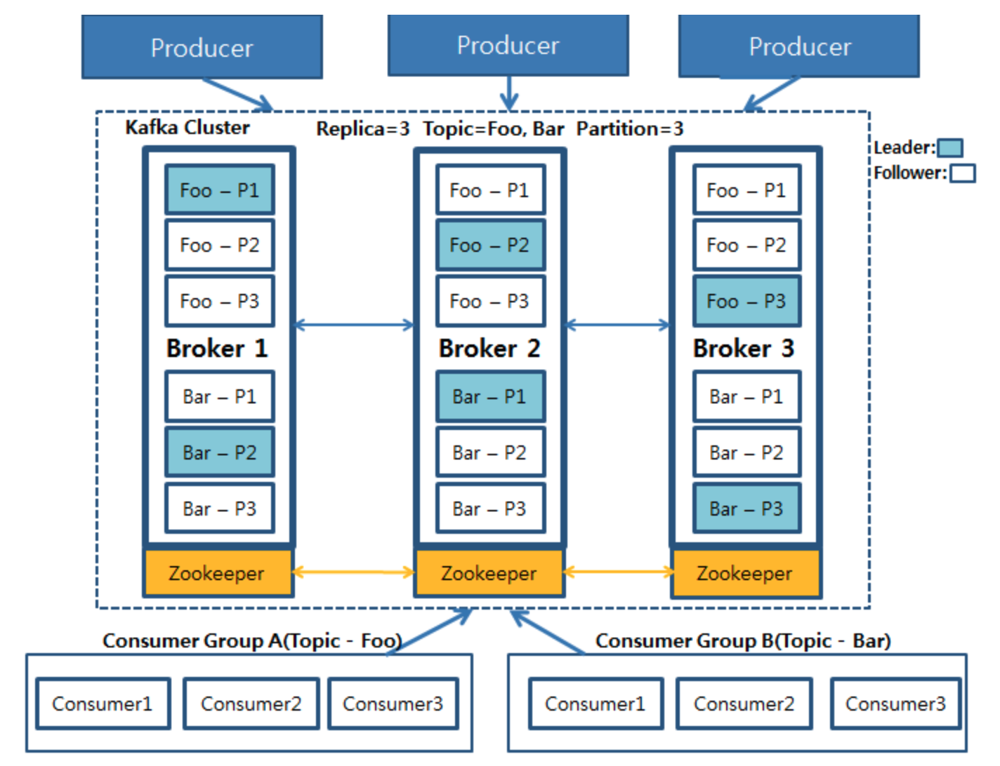
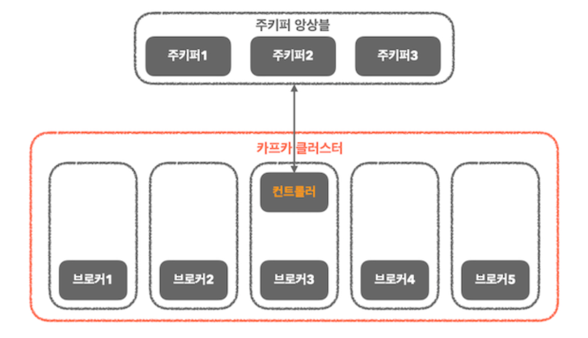
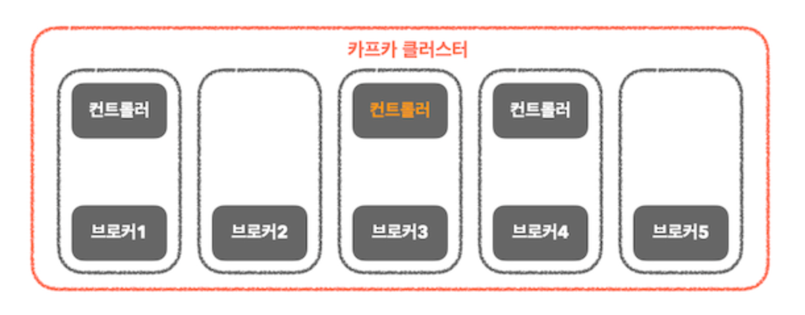

# Apache Kafka

1. Apache Kafka가 무엇인가요 ?
	1. Apache 사에서 Scala로 작성해서 개발한 게시-구독 메시징 시스템. 
	2. 분산, 분할, 복제된 로그 서비스
2. 전통적인 메시지 전송 방법
	1. 대기열 : 대기열에서 소비자 풀은 서버에서 메시지를 읽을 수 있으며 각 메시지는 그 중 하나로 이동합니다.
	2. 게시-구독 : 이 모델에서는 메시지가 모든 소비자에게 송출됨.
3. 기존 기술에 비해 Kafka의 이점
	1. 빠르다 : 하나의 Kafka Broker는 초당 메가바이트의 읽기 및 쓰기를 처리하여 수천 명의 클라이언트에 서비스를 제공할 수 있음. (최대 100만 메가바이트)
	2. 확장 가능 : 더 큰 데이터를 지원하기 위해 데이터가 머신 클러스터로 분할되고 간소화됨.
	3. 튼튼하다 : 메시지는 지속적이고 클러스터 내에서 복제되어 데이터 손실을 방지.
4. Kafka에서 Zookeeper란 ? Zookeeper없이 사용 가능 ?
	1. Zookeeper란 Kafka가 적용한 분산 애플리케이션에 사용되는 오픈 소스 고성능 조정 서비스. 

---

## ✨ 카프카 등장 배경


시스템이 복잡해 짐에 따라 데이터를 보내고 받는 시스템 간의 관계가 더욱 복잡해짐.  protocol, data format, data schema 등이 다 다르다면 복잡도는 더욱 올라가게 되었음.

이를 해결하기 위해 링크드인에서 2011년에 Kafka 를 개발하였음.



위 아키텍처는 시스템간 의존도를 떨어뜨려 모두 Kafka 를 통해 데이터를 주고받게 되어있음. 

### 💡 사용 경험

1. **특화 프로젝트 - 빅데이터 분산 (데이터 스트림 처리)**

  

  - 카프카를 통해 Youtube Url 을 Spark 로 쏴주고, Spark 에서 데이터 분산 분석을 진행한 뒤 다시 카프카로 Spring 에 전송. 

    - **SpringBoot** 

    ```java
    public void sendYoutubeUrl(String url) {
    		try (KafkaProducer<String, String> kafkaProducer = createKafkaProducer()) {
    			ProducerRecord<String, String> record = new ProducerRecord<>(youtubeUrlTopic, url);
    			RecordMetadata metadata = kafkaProducer.send(record).get();
    
    			System.out.printf("Produced record (key=%s, value=%s) meta(partition=%d, offset=%d)%n",
    				record.key(), record.value(), metadata.partition(), metadata.offset());
    		} catch (Exception e) {
    			e.printStackTrace();
    		}
    	}
    
    	public Payload consumeYoutubeAnalyze() {
    		try (KafkaConsumer<String, String> kafkaConsumer = createKafkaConsumer()) {
    			while (true) {
    				ConsumerRecords<String, String> records = kafkaConsumer.poll(Duration.ofMillis(100));
    				for (ConsumerRecord<String, String> record : records) {
    					String value = record.value();
    					System.out.printf("Received record (key=%s, value=%s, partition=%d, offset=%d)%n",
    						record.key(), value, record.partition(), record.offset());
    
    					// 메시지 처리
    					JSONObject jsonObject = new JSONObject(value);
    
    					List<Payload.Comment> commentList = Arrays.stream(jsonObject.getJSONArray("comment_df").toList().toArray())
    						.map(obj -> {
    							JSONObject commentObj = new JSONObject((String) obj);
    							return new Payload.Comment(
    								commentObj.getString("id"),
    								commentObj.getString("comments"),
    								commentObj.getInt("likes"),
    								commentObj.getInt("dislikes"),
    								commentObj.getDouble("sentiment"),
    								commentObj.getInt("label")
    							);
    						})
    						.collect(Collectors.toList());
    
    					List<Payload.AnalyzeResult> resultList = Arrays.stream(jsonObject.getJSONArray("cnt_df").toList().toArray())
    						.map(obj -> {
    							JSONObject resultObj = new JSONObject((String) obj);
    							return new Payload.AnalyzeResult(
    								resultObj.getInt("label"),
    								resultObj.getInt("count"),
    								resultObj.getDouble("ratio")
    							);
    						})
    						.collect(Collectors.toList());
    
    					JSONObject videoInfoJson = jsonObject.getJSONObject("video_info");
    					Payload.VideoInfo videoInfo = new Payload.VideoInfo(
    						videoInfoJson.getString("channel_title"),
    						videoInfoJson.getString("subscriber_count"),
    						videoInfoJson.getString("comment_count"),
    						videoInfoJson.getString("like_count"),
    						videoInfoJson.getString("title"),
    						videoInfoJson.getString("view_count")
    					);
    
    					Payload payload = new Payload(commentList, resultList, videoInfo);
    
    					// 잘 들어갔는지 확인하려고 출력해봄
    					ObjectMapper mapper = new ObjectMapper();
    					String jsonString = mapper.writeValueAsString(payload);
    					System.out.println(jsonString);
    
    					return payload;
    				}
    			}
    		} catch (Exception e) {
    			e.printStackTrace();
    		}
    		return null;
    	}	
    
    ```

    - **Spark Streaming**

      ```python
      consumer = KafkaConsumer(
          'youtube_url',
          bootstrap_servers=['localhost:9092'],
          auto_offset_reset='latest',  # earliest or latest
          enable_auto_commit=True,
          group_id=None
      )
      
      producer = KafkaProducer(bootstrap_servers=['localhost:9092'],
                               value_serializer=lambda x:
                               json.dumps(x).encode('utf-8'))
      ```

      

2. **자율 프로젝트 - MSA** 
     

     - MSA 환경에서 DB간 데이터 정합성을 맞추기 위해 사용.  
     - 예시
       - 프롬프트 데이터 동기화를 위해 PromptService -> SearchService (ES) 간 DB 변경이 있을 때 마다 이벤트 발행.
       - Prompt Service 에서 Notice Service로 이벤트 발행. 

     ```java
     public NoticeRequest sendUserNotice(String promptUuid, String crntMemberUuid) {
     
     		Prompt prompt = promptRepository.findByPromptUuid(UUID.fromString(promptUuid))
     				.orElseThrow(PromptNotFoundException::new);
     
     		NoticeRequest newNotice = new NoticeRequest(crntMemberUuid,
     				"사용해본 프롬프트를 평가하세요 : " + prompt.getTitle(),
     				"평가 url");
     
     		kafkaProducer.sendNotification("send-notification", newNotice);
     
     		return newNotice;
     	}
     ```

     

3. **SSAFY GPT - Kafka Connect**
     

     - Kafka Connect 를 사용하여 MySQL (소스 DB) 에 변경이 일어날 때 마다 자동으로 감지하여 ES와 정합성을 맞추어줌. (코드 작성 불필요)

       - **Prompt Connector (Source Connector)**

       ```json
       {
          "name": "prompt-connector",
           "config": {
             "connector.class": "io.debezium.connector.mysql.MySqlConnector",
             "tasks.max": "1",
             "database.hostname": "labgptbe.p.ssafy.io",
             "database.port": "3306",
             "database.user": "ssafy",
             "database.password": "ssafy",
             "database.server.id": "102132",
             "database.server.name": "GPT_EXTENSION",
             "connectionTimeZone": "Asia/Seoul",
             "db.timezone": "Asia/Seoul",
             "database.whitelist": "ssafyv2",
             "table.include.list": "ssafyv2.prompt",
             "topic.prefix": "ssafyv2-mysql",
             "include.schema.changes": "false",
             "schema.history.internal.kafka.topic": "dbhistory.prompt",
             "schema.history.internal.kafka.bootstrap.servers": "kafka1:9092,kafka2:9092,kafka3:9092",
             "database.history.kafka.bootstrap.servers": "kafka1:9092,kafka2:9092,kafka3:9092",
             "snapshot.mode": "when_needed",
             "binary.handling.mode": "base64",
             "database.history.kafka.topic": "dbhistory.prompt",
       
             "transforms": "unwrap,convertPromptUuid,convertMemberUuid",
             "transforms.unwrap.type": "io.debezium.transforms.ExtractNewRecordState",
             "transforms.unwrap.drop.tombstones": "false",
             "transforms.unwrap.delete.handling.mode":"rewrite",
       
             "transforms.convertPromptUuid.type": "com.github.cjmatta.kafka.connect.smt.InsertUuid$Value",
             "transforms.convertPromptUuid.uuid.field.name": "prompt_uuid",
       
             "transforms.convertMemberUuid.type": "com.github.cjmatta.kafka.connect.smt.InsertUuid$Value",
             "transforms.convertMemberUuid.uuid.field.name": "member_uuid"
       
           }
       }	
       ```

       - **Elastic Search Connector (Sink Connector)**

       ```json
       {
          "name": "es-connector",
          "config": {
            "connector.class": "io.confluent.connect.elasticsearch.ElasticsearchSinkConnector",
            "connection.url": "http://elk-elasticsearch-1:9200",
            "connection.username": "elastic",
            "connection.password": "gptextension",
            "connectionTimeZone": "Asia/Seoul",
            "tasks.max": "1",
            "topics": "ssafyv2-mysql.ssafyv2.prompt",
            "type.name": "_doc",
            "key.converter": "org.apache.kafka.connect.json.JsonConverter",
            "value.converter": "org.apache.kafka.connect.json.JsonConverter",
            "key.converter.schemas.enable": "true",
            "value.converter.schemas.enable": "true",
            "transforms": "ExtractField, unwrap",
            "transforms.ExtractField.type": "org.apache.kafka.connect.transforms.ExtractField$Key",
            "transforms.ExtractField.field": "prompt_id",
            "transforms.unwrap.type": "io.debezium.transforms.ExtractNewRecordState",
            "transforms.unwrap.drop.tombstones": "false",
            "transforms.unwrap.delete.handling.mode": "rewrite",
            "behavior.on.null.values": "IGNORE",
            "db.timezone": "Asia/Seoul"
          }
       }
       ```

       

## 📌 카프카 기초 다지기

### ✔ 카프카 구조

- 단일 모드
  - Producer, Consumer 는 각기 다른 프로세스에서 비동기로 동작


- 클러스터 기반




### ✏️ 카프카 구성 요소


- 주키퍼(Zookeeper) : 카프카의 메타데이터(metadata) 관리 및 브로커의 정상상태 점검(health check)을 담당.
- 카프카(Kafka) : 여러 대의 브로커를 구성한 클러스터를 의미. 
- 브로커(broker) : 카프카 어플리케이션이 설치된 서버 또는 노드를 의미.
- 프로듀서(producer) : 카프카로 메시지를 보내는 역할을 하는 클라이언트를 총칭. 
- 컨슈머(consumer) : 카프카에서 메시지를 꺼내가는 역할을 하는 클라이언트를 총칭.
- 토픽(topic) : 카프카는 메시지 피드들을 토픽으로 구분하고, 각 토픽의 이름은 카프카 내에서 고유함. 
- 파티션(partition) : 병렬 처리 및 고성능을 얻기 위해 하나의 토픽을 여러 개로 나눈 것.
- 세그먼트(segment) : 프로듀서가 전송한 실제 메시지가 브로커의 로컬 디스크에 저장되는 파일을 말함.
- 메시지(message) 또는 레코드(record) : 프로듀서가 브로커로 전송하거나 컨슈머가 읽어가는 데이터 조각. 

### ✔️ 1) 리플리케이션 (replication)
- 각 메시지들을 여러 개로 복제해서 카프카 클러스터 내 브로커들에 분산시키는 동작을 의미.
- 리플리케이션 동작 덕분에 하나의 브로커가 종료되더라도 카프카는 안정성을 유지할 수 있음.
- 리플리케이션 팩터 수가 커지면 안정성은 높아지지만 그만큼 브로커 리소스를 많이 사용하게 됨.
	- 복제에 대한 오버헤드를 줄여서 최대한 브로커를 효율적으로 사용하는 것이 중요. 

### ✔️ 2) 파티션 (partition)
- 하나의 토픽이 한 번에 처리할 수 있는 한계를 높이기 위해 토픽 하나를 여러 개로 나눠 병렬 처리가 가능하게 만든 것.
- 파티션 수만큼 컨슈머 연결 가능.
- 파티션 번호는 0부터 시작.
- 파티션 수는 절대 줄일 수 없음. 

### 📌 acks

- 확인의 의미. 
- 프로듀서가 메시지를 보내고,  브로커에 잘 전달이 되었는지 확인하기 위한 옵션.
- 0, 1, all 
  - acks=0 : Producer는 acknowledgment를 기다리지 않음(데이터 손실 가능성이 있다.)
  - acks=1 : producer는 leader acknowledgment를 기다렸다가 다음 액션을 함(제한된 데이터 손실 가능성)
  - acks=all: leader+ISR acknowledgment를 모두 기다림(no data loss)


---

### ✏️ 카프카의 핵심 개념
- 높은 처리량, 빠른 응답 속도, 안정성
- 그렇다면 위와 같은 특징을 어떻게 가지게 되었는가. 

### ✔️ 1) 분산 시스템
- 분산 시스템이란 ?
	- 네트워크상에서 연결된 컴퓨터들의 그룹, 단일 시스템이 갖지 못한 높은 성능을 목표로 함. 
- 성능이 높다는 장점 + 하나의 서버 또는 노드 등에 장애가 발생할 때 다른 서버 또는 노드가 대신 처리하므로 장애 대응이 탁월함.
- 부하가 높은 경우에는 시스템 확장이 용이함.

### ✔️ 2) 페이지 캐시
- 카프카가 OS의 페이지 캐시를 이용하여 직젒 디스크 읽고 쓰기를 하기 않고 페이지 캐시를 통해 읽고 쓰기를 하여 높은 처리량을 얻을 수 있음. 

### ✔️ 3) 배치 처리, 압축 전송


---

## 💡 Kakfa Connect
- 아파치 카프카의 오픈소스 프로젝트 중 하나로, 데이터베이스 같은 외부 시스템과 카프카를 손쉽게 연결하기 위한 프레임워크. 
### 📌 Kafka Connect
- 커넥터를 동작하도록 실행해주는 프로세스 
- 파이프라인으로 동작하는 커넥터를 동작하기 위해서는 커넥트를 실행시켜야 함. 
#### 1. 단일 실행 모드 커넥터 (Standalone)
- 간단한 데이터 파이프라인 구성 또는 개발용
#### 2. 분산 모드 커넥트 (Distributed)
- 실질적으로 상용에 활용하고 싶다면 분산 모드로 사용함.
- 여러 개의 프로세스를 한 개의 클러스터로 묶어서 이용됨. (두 개 이상의 커넥트가 하나의 클러스터로 묶이는 것.)
- 일부 커넥트에 장애가 발생하더라도 파이프라인을 자연스럽게 failover 해서 나머지 실행중인 커넥트에서 데이터를 지속적으로 처리할 수 있도록 도와줌. 

### 📌 Kafka Connector
- 실질적으로 데이터를 처리하는 코드가 담긴 jar 패키지
- 일련의 템플릿과 같은 특정 동작을 하는 코드 뭉치
- 데이터를 어디에서 어디로 복사해야하는지의 작업을 정의하고 관리하는 역할. 
- 파이프라인에 필요한 동작, 설정, 실행하는 메서드들이 포함되어 있음. 
#### 1. Sink Connector
- 어딘가로 데이터를 싱크한다. -> 특정 토픽에 있는 데이터를 특정 저장소에 저장하는 역할.
- 컨슈머와 같은 역할.
#### 2. Source Connector
- 데이터베이스로 부터 데이터를 가져와서 토픽에 넣는 역할. 
- 프로듀서 역할.

---


### 📌 KRaft 의 등장과 배경
- Kafka Raft는 아파치 카프가의 분산 시스템을 관리하기 위해 도입된 새로운 메커니즘.
- 주키퍼의 의존성은 카프카의 확장성과 유지보수에 여러 제약을 가져왔고, 이를 해결하기 위해 카프카 자체 내에서 분산 시스템의 상태를 관리하는 방식을 도입하기로 결정하였음. 


### ✨ 주키퍼란

- 분산 코디네이션 시스템.
- 카프카 브로커를 하나의 클러스터로 코디네이팅하는 역할. 
- 카프카 클러스터의 리더를 발탁하는 방식을 제공.
- 새로운 토픽 생성, 브로커 서버 다운 등 카프카 클러스터 내 변화들에 대한 알림을 제공. 


### 📌 주키퍼 사용 시 이슈가 되는 부분
#### 1. 성능적인 부분
브로커는 모든 토픽과 파티션에 대한 메타데이터를 주키퍼에서 읽어야 하며, 메타데이터의 업데이트는 주키퍼에서 동기방식으로 일어나고, 브로커에는 비동기방식으로 전달되었습니다. 
이 과정에서 메타데이터의 불일치가 발생할 수도 있으며, 컨트롤러 재식자 시 모든 메타데이터를 주키퍼로부터 읽어야 하는 것도 부담이었습니다. 
특히 토픽과 파티션이 많은 대규모 카프카 클러스터에서는 오랜 시간이 걸리는 등 병목 현상이 발생할 수 있습니다.

#### 2. 관리적인 부분
주키퍼와 카프카는 완전히 서로 다른 애플리케이션으로, 서로 다른 구성 파일, 환경, 서비스 데몬을 가지고 있습니다. 
결국 관리자는 동시에 서로 다른 애플리케이션을 운영해야 합니다. 동시에 두 가지 애플리케이션을 운영한다는 것은 관리자에게 큰 부담이 됩니다. 
예를 들어, 주키퍼의 릴리스 노트 확인, 버전 업그레이드, 구성 파일 변경과 동시에 카프카의 릴리즈 노트 확인, 버전 업그레이드, 구성 파일 변경을 해야 합니다. 

#### 3. 모니터링 등 
모든 서비스는 모니터링이 필수이며, 주키퍼와 카프카 둘 다 모니터링을 해야 합니다. 
두 애플리케이션은 서로 다른 애플리케이션이므로, 모니터링을 적용하는 방법과 각 애플리케이션에서 보여주는 주요 메트릭도 다릅니다. 
또한 모니터링에 필요한 필수 메트릭을 이해하고 모니터링하는 방법까지 완전히 다릅니다. 
그 외에도 각 애플리케이션에서 빈번하게 발생하는 이슈 또는 장애 상황에 개별적으로 대처해야 하며,
두 애플리케이션  간 통신 이슈라도 발생한다면, 매우 곤혹스러울 것입니다. 

### 📌 KRaft의 주요 목적
- 카프카의 구조를 단순화하고 확장성을 향상시키기 위해서 

### 📌 주키퍼 모드 vs KRaft 모드
#### 1. 주키퍼 모드

- 주키퍼 앙상블과 카프카 클러스터가 존재하며, 카프카 클러스터 중 하나의 브로커가 컨트롤러 역할을 하게 됨.
- 컨트롤러는 파티션의 리더를 선출하는 역할을 하며, 리더 선출 정보를 브로커에게 전파하고 주키퍼에 리더 정보를 기록하는 역할
- 컨트롤러의 선출 작업은 주키퍼를 통해 이루어지는데, 주키퍼의 임시 노드를 통해 이루어짐.
- 임시노드에 가장 먼저 연결에 성공한 브로커가 컨트롤러가 되고, 다른 브로커들은 해당 임시노드에 이미 컨트롤러가 있다는 사실을 통해 카프카 클러스터 내 컨트롤러가 있다는 것을 인식하게 됨 
- 이를 통해 한 번에 하나의 컨트롤러만 클러스터에 있도록 보장할 수 있음. 

#### 2. KRaft 모드

- KRaft 모드는 주키퍼와의 의존성을 제거하고, 카프카 단일 애플리케이션 내에서 메타데이터 관리 기능을 수행하는 독립적인 구조가 되는 것. 
- 주키퍼 모드에서 1개였던 컨트롤러가 3개로 늘어나고, 이들 중 하나의 컨트롤러가 액티브(그림에서 노란색 컨트롤러) 컨트롤러이면서 리더 역할을 담당
- 리더 역할을 하는 컨트롤러가 write 하는 역할도 하게 됨.
- 주키퍼 노드에서는 메타 데이터 관리를 주키퍼가 했다면, KRaft 모드에서는 카프카 내부의 별도 토픽을 이용하여 메타 데이터를 관리합니다. 
- 액티브인 컨트롤러가 장애 또는 종료되는 경우, 내부에서는 새로운 합의 알고리즘을 통해 새로운 리더를 선출.
- 리더를 선출하는 과정
	- 후보자들은 적합한 리더를 투표하게 되고 후보자 중 충분한 표를 얻으면, 해당 컨트롤러가 새로운 리더가 됨. 

### 📌 KRaft의 성능
- 파티션 리더 선출의 최적화
- 컨트롤러의 주요 역할은 파티션의 리더를 선출하는 것
- 복구 소요 시간이 아주 큰 차이가 나는데, 그 이유는 KRaft 모드에서의 컨트롤러는 메모리 내에 메타데이터 캐시를 유지하고 있으며, 주키퍼와의 의존성도 제거해 내부적으로 메타데이터의 동기화와 관리과정을 효율적으로 개선했기 때문
- 액티브 컨트롤러 장애 시 최신 메타데이터가 메모리에 유지되고 있으므로, 메타데이터 복제하는 시간도 줄어들어 보다 효율적인 컨트롤러 리더 선출 작업

### - Raft 알고리즘 (Raft Consensus Algorithm)
- 분산 합의 알고리즘 
- Leader - Candidate - Follower 


---

### 📍 RabbitMQ
- AMQP 프로토콜을 구현한 메시지 브로커
- AMQP (Advanced Message Queuing Protocol)
	- 메세지 지향 미들웨어를 위한 개방형 표준 응용 계층 프로토콜
	- Client, Middleware broker 간의 메시지를 주고 받기 위한 프로토콜

### 📌 MQ 사용 구분
- 대용량 데이터 처리, 실시간, 고성능, 고가용성이 필요한 경우, 또는 저장된 이벤트를 기반으로 로그를 추적하고 재처리 하는 것이 필요한 경우 **Kafka** 사용
- 복잡한 라우팅을 유연하게 처리해야 하고, 정확한 요청-응답이 필요한 Application을 쓸 때, 혹은 트래픽은 작지만 장시간 실행되고 안정적인 백그라운드 작업이 필요한 경우 **RabbitMQ**
- 이벤트 데이터를 DB에 저장하기 때문에 굳이 미들웨어에 이벤트를 저장할 필요가 없는 경우, consumer에게 굳이 꼭 알람이 도착해야한다는 보장 없이 알람처럼 Push 보내는 것만 중요하다면 유지보수가 편한 **Redis** 를 사용. 

---

### ✨ Message Key 방식

- Producer 는 Key(String, Number, etc ..) 를 선택하여 메시지를 보낼 수 있고, Key Hashing 방식을 통해 특정 파티션으로 전송된다.

