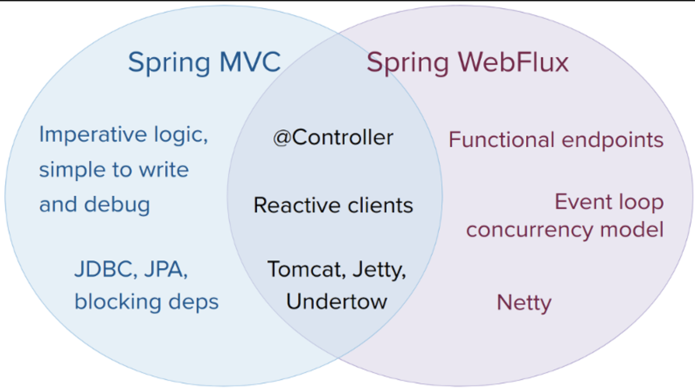
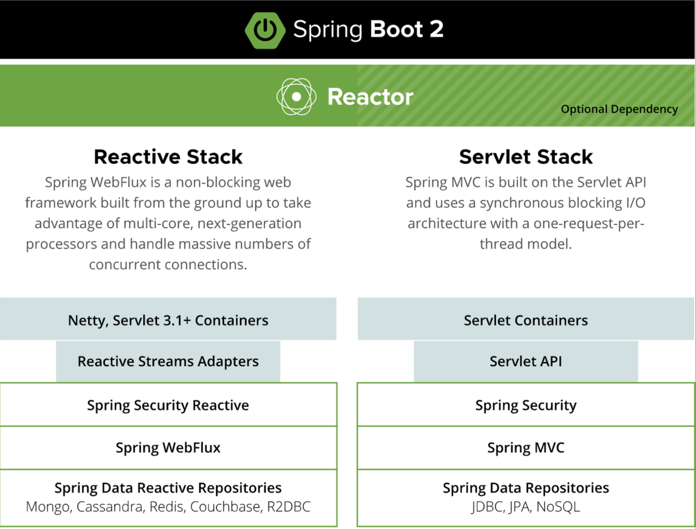
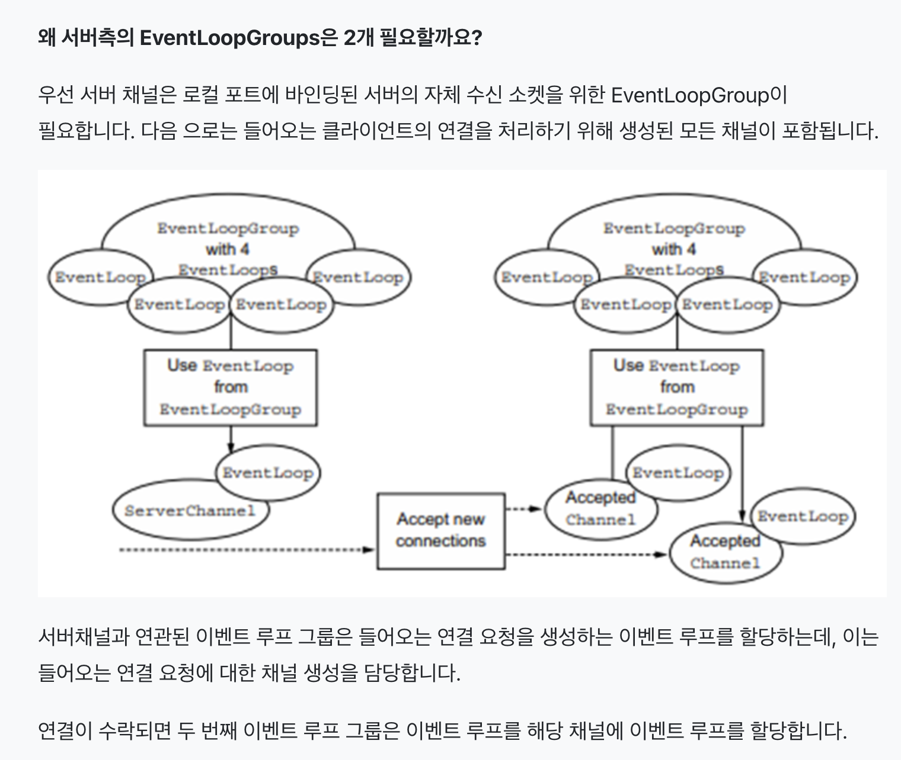
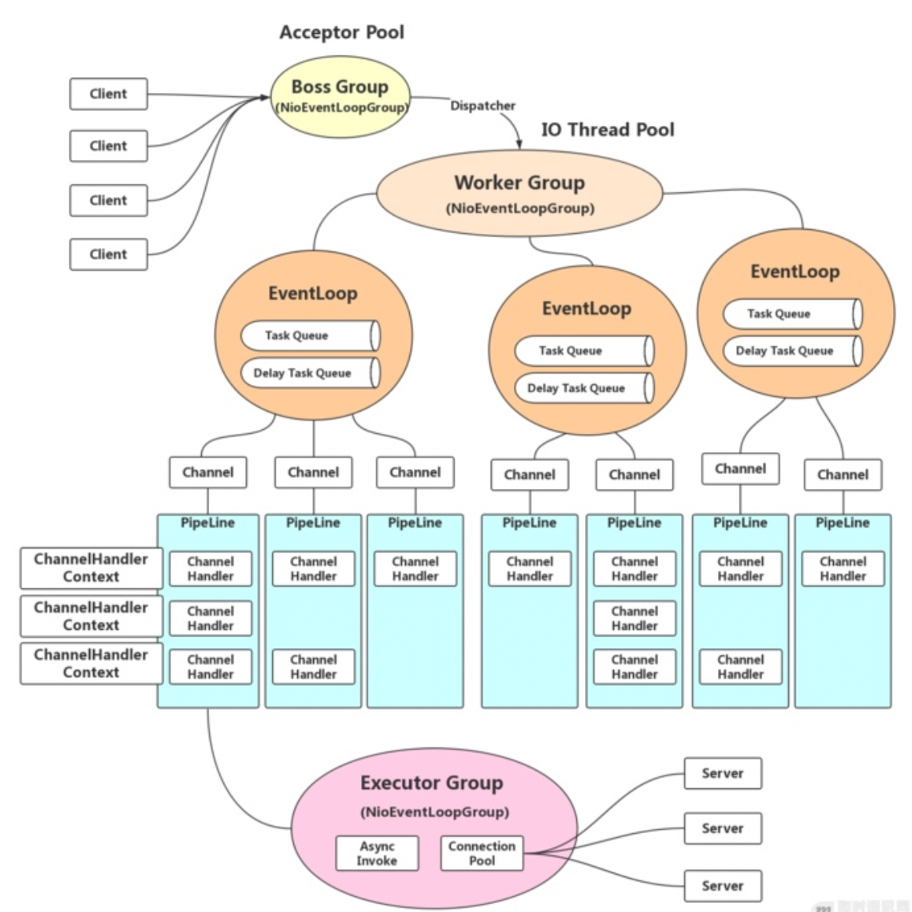

## Spring WebMVC

- Spring WebMVC는 Servlet API를 기반으로 구축된 웹 프레임워크이다.
- Servlet은 요청-응답 기반의 동기적인 웹 프로그래밍 모델을 기반으로 하며 클라이언트 요청을 받아 처리하고, 응답을 반환하는 동기적인 통신 방식이다.
- WebMVC는 이름에서 알 수 있듯이 MVC 디자인패턴을 사용하도록 되어있다.
- 동기적인 방식으로 작동하며, 블로킹 IO 방식을 사용
    - **블로킹 IO란?**
        
        블로킹 IO 방식은 클라이언트로부터 요청이 발생한 시점부터 서버가 이를 처리하고 클라이언트에게 응답을 주기 전까지 대기하는 구조이다. 하나의 쓰레드가 클라이언트의 요청을 처리하는 동안에는 다른 서비스를 수행할 수 없는 블로킹상태가 된다.
        
    - **동작 방식**
        
        Dispatcher Servlet을 통해 Controller로 전달되며 이 때 동시 접속을 위한 사용자의 수만큼 쓰레드를 생성해 각각의 쓰레드가 요청이 완료될 때까지 점유 되어있는 상태로 존재하며 클라이언트에게 요청에 대한 응답을 돌려줄 때 Tomcat의 Thread Pool를 이용하여 해당 쓰레드가 다시 가용한 상태로 전환되는 방식
        

### 장점

- 가장 오래된 전통적인 방식으로 안정성이 높다.
- 전통적인 프로그래밍 방식으로 개발을 하기에 배우기 쉽고 개발 생산성이 높다.
- 다양한 라이브러리와 도구들이 Spring WebMVC와 호환되어 방대한 생태계와 문서가 있다.
- JPA와 같은 ORM 프레임워크와의 통합이 용이하며, 트랜잭션 관리가 편리하다.

### 단점

- 각 요청마다 쓰레드를 할당하기 때문에, 많은 요청이 동시에 들어오면 많은 부하가 발생하고 쓰레드 풀이 고갈될 수 있다.
- 동기식 I/O로 인해, 외부 서비스와의 통신에서 대기 시간이 발생하면 전체 성능에 영향을 미칠 수 있다.

## Spring WebFlux

- Spring WebFlux는 Spring 5에서 새롭게 도입된 Reactive Streams API를 기반으로 구축된 비동기적 웹 프레임워크이다.
- Spring 5는 Spring Boot 2부터 도입이 되었으며, 이로 인해 Spring Boot 2부터는 Reactive Stack과 Servlet Stack 2가지가 존재
- 비동기적인 방식으로 작동하며, 논 블로킹 IO 방식을 사용
    - **논 블로킹 IO란?**
        
        논 블로킹 IO 방식은 클라이언트로부터 요청을 전달받은 뒤 대기하지 않고 다른 처리를 수행하는 구조로 하나의 쓰레드가 많은 각 작업을 굉장히 적은 시간으로 쪼개어 하나씩 수행하도록 하는 방법이다. 이를 이벤트 루프 방식이라고도 한다.
        
    - **동작 방식**
        
        동시 접속하는 사용자의 수만큼 쓰레드를 생성하지 않는다. 하나의 요청을 받은 쓰레드가 해당 요청에 대한 결과를 리턴하는 과정에서 다른 작업도 함께 수행할 수 있기 때문에 다수의 쓰레드 풀을 생성할 필요가 없다.
        
        **주의:** 하나의 쓰레드가 다수의 작업을 수행할 수 있기에 적은 쓰레드로 다수의 작업을 수행할 수 있다는 것이지 WebFlux가 모든 요청에 대해 싱글 쓰레드로 작동한다는 것은 아니다.
        
- Reactive Streams의 구현체 중 하나인 Reactor를 기반으로 개발
- Reactor는 Pub-Sub 패턴을 기반으로 하여 데이터가 생성되는 시점과 데이터가 소비되는 시점을 분리, 비동기적으로 처리할 수 있다.
- 대규모 트래픽이 발생할 경우 효율적인 리소스 관리와 적은 쓰레드로도 높은 처리량을 보장할 수 있다.
- **탄생 배경**
    
    웹 서비스아키텍처 구축 시 더 적은 자원으로 더 빠르게 서비스를 제공하려는 수요가 늘어나기 시작했다. 이에 Node.js에서는 먼저 이벤트 루프를 활용한 논 블로킹 IO를 선보이면서 웹 서비스 아키텍처에 새로운 패러다임이 제시되었다. 이러한 Node.js의 성공을 통해 자바 진영에서도 논블로킹 IO 모델에 대한 필요성이 꾸준히 제기되었고, Spring 5부터 WebFlux라는 이름의 리액티브 라이브러리를 제공
    

### 장점

- 많은 트래픽과 높은 동시성을 필요로 하는 애플리케이션에서 우수한 성능과 효율성을 발휘한다.
- 요청마다 쓰레드를 할당하지 않기 때문에, 더 적은 리소스로 더 많은 요청을 처리할 수 있어 효율적인 리소스 사용이 가능하다.
- 효율적인 리소스 사용으로 시스템에 훨씬 적은 부하가 발생하고, Context-Switching도 현저히 줄어든다.
- Backpressure의 지원으로, 시스템의 오버로드를 방지하고 자원을 효율적으로 활용할 수 있다.
    - **Backpressure란?**
        
        들어오는 수많은 데이터를 적절하게 제어해서 과부하가 발생하지 않도록 하는 수단
        
        특정 조건에서 Upstream에서 발생하는 데이터의 양이 Downstream에서 처리할 수 있는 데이터의 양보다 많을 때 발생하는 문제를 처리하기 위한 기법
        
    - **Backpressure의 전략**
        - **IGNORE:** Backpressure를 적용하지 않는다.
        - **ERROR:** Downstream으로 전달할 데이터가 버퍼에 가득 찰 경우, Exception을 발생시키는 전략
        - **DROP:** Downstream으로 전달할 데이터가 버퍼에 가득 찰 경우, 버퍼가 비워질 때 까지 버퍼 밖에서 대기하는 먼저 emit된 데이터부터 Drop 시키는 전략
        - **LATEST:** Downstream으로 전달할 데이터가 버퍼에 가득 찰 경우, 버퍼가 비워질 때 까지 버퍼 밖에서 대기하는 가장 최근에(나중에) emit된 데이터부터 버퍼에 채우는 전략
            - **버퍼가 비워질 때 까지인 이유:**
                
                Drop 전략의 경우, 버퍼 안의 데이터가 Subscriber에게 한개 전달되면, 버퍼 공간이 한개 비니까 한개의 데이터가 채워지는것이 아니라 전체 버퍼 중에 70-80 퍼센트 정도가 한번에 비워진다고 보시면 될것 같습니다.
                
                즉, 데이터 한개가 버퍼에서 비워지는 것이 아니라 버퍼가 가득찬 상태에서 Downstream이 데이터를 처리할 수 있는 상태가 될 때까지 Upstream에서 emit된 데이터는 Drop이 된다고 생각하시면 될것 같습니다.
                
        - **BUFFER:** Downstream으로 전달할 데이터가 버퍼에 가득 찰 경우, 버퍼 안에 있는 데이터를 Drop 시키는 전략
            - **BUFFER DROP-LATEST:** 버퍼가 오버플로우가 발생한다면, 버퍼안의 데이터 중 가장 최근에 들어온 데이터를 Drop 시키는 전략
            - **BUFFER DROP-OLDEST:** 버퍼가 오버플로우가 발생한다면, 버퍼안의 데이터 중 가장 오래된 데이터를 Drop 시키는 전략
    - **사용 예시**
        
        ```java
        memberFlupetRepository.findAllByIsDeadIsFalse() //Flux<>타입으로 리턴
                    .onBackpressureBuffer(256, //최대 버퍼 사이즈는 256
                        {dropped -> dropList.add(dropped)},
                        BufferOverflowStrategy.DROP_LATEST)
                    .publishOn(Schedulers.parallel(), false, 32) //쓰레드를 하나를 더 새로 생성
                                                //delayError, prefetch
                    .subscribe(this::handleData) //들어오는 데이터 구독하는 시점(데이터 처리)
                    { error -> log.error(error.toString()) }
        ```
        
- 특히, MSA환경에서 논 블로킹 방식으로 인해 WebFlux는 높은 성능을 발휘할 수 있다.
    - 이러한 점으로 인해, Spring Cloud Gateway에서는 기본적으로 WebFlux를 사용하는 듯 함(?)
    - WebMVC의 문제점
        - 각 서비스간 정보 교환을 위한 통신에서 Blocking 시간이 길어지면 응답을 기다리는데 쓰레드를 모두 소진할 수도 있다.
        - 타임아웃이 발생할 정도의 지연이 발생하면 다른 모듈에도 영향을 주어 전체 시스템이 다운될 수 있다.

### 단점

- 일반적인 프로그래밍 방식과 달리 학습 곡선이 높고, 이로 인해 개발 생산성이 떨어진다.
- 코드가 복잡해지고 가독성이 떨어져 디버깅이 어려울 수 있다.
    - 위와 같은 단점들은 Kotlin을 사용하는 환경(일명, 코프링)에서는 WebFlux 사용시 기본적으로 Coroutine을 사용할 수 있어 상당 부분 해결 가능
    - 물론, Backpressure와 같이 Reactor에서 제공하는 다양한 기능들이 있기에 Reactor를 같이 알아두는 것이 좋다.
- 리액티브 방식을 제공하는 라이브러리들이 매우 제한적이어서 호환성이 떨어질 수 있다.

## 비교





### 공통점

- 둘 다 어노테이션 기반의 프로그래밍 모델로 Spring에서 제공하는 대부분의 어노테이션을 그대로 사용할 수 있다.
- Spring Security, Spring Data 등 다른 Spring 생태계와의 호환성 유지
- 의존성 주입(DI), AOP, 서비스 추상화 등 핵심 스프링 프레임워크 기능 제공
- 둘 다 Servlet을 중요한 역할로 사용하고 HTTP 요청을 처리하고 응답을 생성한다.
    - Servlet 3.0은 Async Servlet 기능을 지원하며, 이를 통해 비동기적인 요청 처리를 할 수 있다.

### 차이점

- WebMVC는 JPA와 같은 훌륭한 ORM기반 기술을 사용할 수 있다.
- WebFlux는 Tomcat 뿐만 아니라 Netty 서버에서도 실행할 수 있다.(기본적으로 Netty 기반으로 동작)

## Tomcat VS Netty

### Tomcat

- Tomcat은 NIO Connector를 통해 사용자의 요청을 받는다.(Tomcat 9 버전 부터 NIO Connector를 기본으로 사용)
    - NIO Connector에서는 Acceptor를 통해 소켓을 수신하고 이를 PollerEvent Queue에 Publish 한다. Poller는 해당 Event Queue의 소켓을 구독하고 있어 획득하고, Channel들을 Processing 한다. 각 Channel들은 모두 Worker Thread에 할당되어 작업이 진행되며 이후는 CoyoteAdapter 로직을 통해 Servlet에 Dispatch하는 작업이 진행된다.
- Tomcat의 표준 HTTP Connector(NIO 등)에는 몇가지 속성을 지원
    - **MaxConnections**
        
        서버가 요청을 처리할 수있는 Connection의 수를 의미(기본값은 8192)
        
    - **AcceptCount**
        
        Connection수가 MaxConnection에 도달했을 경우 추가적인 Connection 요청을 대기시키는 공간(기본값은 100, 자료구조는 Queue)
        
    - **MaxThread**
        
        요청을 처리하는 쓰레드의 최대 수이다. 처리될 수 있는 동시 요청의 최대 수를 결정(기본값은 200)
        
- Tomcat은 들어오는 각 요청에 쓰레드를 할당하는 Thread Per Request 모델로 동작
- **기본 동작 방식**
    
    Tomcat은 기본적으로 8192개의 connection을 처리할 수 있다. 이때 Thread pool에서 가능한 요청 처리 Thread가 모두 작업 중일때(기본 200) 8192개 이후의 요청들은 모두 요청을 대기시키는 Queue로 이동하게 된다. 해당 Queue는 100개 까지의 요청을 더 대기시킬 수 있으며, 이후의 요청에 대해서는 timeOut 등의 처리가 이루어진다.
    

### Netty

- 비동기 이벤트 기반 네트워크 응용프로그램 프레임워크
- Netty는 비동기 처리를 지향하여, 요청을 보낸 뒤 즉시 반환한 다음 다른 작업을 하다 요청한 작업의 처리가 완료되면 나중에 응답 받는 방식
- 적은 수의 쓰레드로 많은 연결을 모니터링 할 수 있다.
- 호출되면 작업이 완료될 떄까지 쓰레드가 멈추는 블로킹 방식과 하나의 스레드로 여러 클라이언트를 대응하는 논 블로킹 소켓을 모두 지원
- HTTP 방식을 소켓에 적용한 모델로 Netty는 추상화 방식을 지원하기 때문에 소켓 모드를 바꾸어도 데이터 송수신 부분의 로직을 변경하지 않도록 작성할 수 있다.(이거는 자바 소켓하고 관련된 얘기인 것 같은데 잘 모르겠음ㅠㅠ)
- Netty 는 Channel에서 발생하는 이벤트들을 EventLoop가 처리하는 구조를 가진다.
- **Netty의 구성 요소**
    - **Channel**
        - 네트워크 소켓이나, I/O 작업에 대해 양방향으로 동작할 수 있는 통로
        - Channel의 모든 I/O 동작은 비동기로 동작
        - 이는 Point-to-Point 통신을 추상화한 개념으로 자바 소켓으로 직접 작업할 때의 복잡성을 완화하는 API를 제공
        - I/O 작업의 결과 또는 상태에 대한 정보를 ChannelFuture 인스턴스와 함께 반환
    - **ChannelPipeline**
        - Channel을 통해 흐르는 인바운드와 아웃바운드 이벤트에 동작하는 ChannelHandler 인스턴스들의 리스트
        - 각각의 Channel은 ChannelPipeline을 가지고 있다.
    - **ChannelHandler**
        - 실제 요청에 대한 처리를 하기 위한 인터페이스
        - 인바운드와 아웃바운드 데이터 처리에 적용되는 애플리케이션 로직의 컨테이너 역할을 한다.(비즈니스 로직이 들어가는 곳)
    - **Bootstrap**
        - 네트워크 계층을 구성하기 위한 컨테이너를 제공하며, 여기에는 프로세스를 지정된 포트에 바인딩하거나 한 프로세스를 지정된 포트의 지정된 호스트에서 실행 중인 다른 프로세스에 연결하는 등의 일을 한다.
        - 일반적으로 연결에 대해 포트에 바인딩하는 것을 Server측의 BootStrap 이라고하며, 지정된 포트의 호스트에 연결하는 것을 Client측의 BootStrap이라고 한다.
        - Server측의 BootStrap은 2개의 EventLoopGroup을 가지고, Client측은 1개의 EventLoopGroup을 가진다.
            
            
            
    - **EventLoopGroup**
        - EventLoopGroup은 EventLoop들의 그룹으로, 같은 그룹에 속한 EventLoop들은 쓰레드와 같은 몇몇 리소스들을 공유하게 된다.
        - 워커 스레드(EventLoop)는 초기화 시점 런타임에 사용할 수 있는 프로세서 수로 세팅된다.
    - **EventLoop**
        - 이벤트를 실행하기 위한 무한루프 스레드
        - EventLoop는 절대 변경되지 않는 정확히 하나의 쓰레드에 의해 구동
        - 단일 EventLoop가 여러 채널을 서비스하도록 할당될 수 있다.
        - **기본 동작:** 객체(Event Emitters)에서 발생한 이벤트는 이벤트 큐에 입력되고 EventLoop는 큐에 입력된 이벤트가 있을 때 해당 이벤트를 꺼내서 이벤트를 실행
        - 지원하는 쓰레드 종류에 따라 단일 쓰레드 EventLoop와 다중 쓰레드 EventLoop로 나뉜다.
        - 처리한 이벤트의 결과를 돌려주는 방식에 따라 Callback과 Future 패턴으로 나뉜다.
        - 일반적으로 Netty는 단일 쓰레드 이벤트 와 다중 쓰레드 이벤트 모두 종류에 상관없이 순서를 보장
            - **이유:** 하나의 Channel에서 발생한 이벤트는 항상 동일한 EventLoop의 쓰레드에서 처리되기 때문에 발생 순서와 처리 순서가 일치하게 된다. 또한 EventLoop 쓰레드의 이벤트 큐 공유를 막기위해 각 이벤트 큐를 각 Loop Thread 내부에 두기 때문에 순서 보장이 가능하다.
    - **BossGroup**
        - 각 포트별로 접속을 허용해주는 그룹
        - Tomcat에서는 Acceptor의 역할과 동일한 역할을 수행하며, 커넥션이 정상적으로 이루어질 경우 Accepted 된 채널을 WorkerThread로 전달
    - **WorkerGroup**
        - 논 블로킹 모드에서 채널에 읽기와 쓰기 작업을 논 블로킹으로 처리할 수 있다.
- **동작과정**
    
    
    
    BossGroup을 통해 Accepted된 채널들이 각 워커 쓰레드로 전달되고, 해당 Worker Group은 해당된 채널의 이벤트에 따라 EventLoop가 동작된다. 각 EventLoop에는 각자의 이벤트 큐를 보유하고 있어 이벤트의 순서를 보장해 줄 수 있고, 해당되는 Channel들은 PipeLine에 구축된 ChannelHandler들의 체이닝에 따라 동작이 진행되는 구조이다.
    

### 차이점

- Netty는 이벤트 기반의 비동기 네트워크 프레임워크로 클라이언트의 요청을 비동기로 처리하여 적은 스레드로 높은 성능을 제공한다.
Tomcat은 전통적인 서블릿 기반의 웹 어플리케이션 서버(WAS)로, 클라이언트 요청을 처리하기 위해 스레드 풀을 사용한다.
- Netty는 비동기 방식의 클라이언트 요청을 처리하기 위해 멀티 코어를 활용하여 수십만 개의 동시 연결을 처리할 수 있다.
Tomcat은 대규모 웹 어플리케이션을 처리하기 최적화되어 있어 일반적으로 단일 코어로 수천 개의 동시 연결을 처리할 수 있다.
- Netty는 더 적은 기능을 제공하지만, 모듈식 아키텍처를 사용해 개발자가 필요한 기능만 사용할 수 있다. HTTP 뿐만 아니라 다양한 프로토콜을 지원하여 유연성이 높다.
Tomcat은 Java EE 표준에 따라 작동하며 추가적인 확장이나 커스터마이징이 어려울 수 있다.

### 참고

- [https://velog.io/@c65621/Spring-WebFlux-탄생-배경-MVC와의-비교-그리고-장단점](https://velog.io/@c65621/Spring-WebFlux-%ED%83%84%EC%83%9D-%EB%B0%B0%EA%B2%BD-MVC%EC%99%80%EC%9D%98-%EB%B9%84%EA%B5%90-%EA%B7%B8%EB%A6%AC%EA%B3%A0-%EC%9E%A5%EB%8B%A8%EC%A0%90)
- https://devuna.tistory.com/108
- https://corono.tistory.com/33
- https://simgee.tistory.com/30
- https://velog.io/@akfls221/Netty
- https://mumomu.tistory.com/176
- https://hbase.tistory.com/116
- [https://velog.io/@wnwjq462/Spring-Webflux-Netty-기본-개념](https://velog.io/@wnwjq462/Spring-Webflux-Netty-%EA%B8%B0%EB%B3%B8-%EA%B0%9C%EB%85%90)
