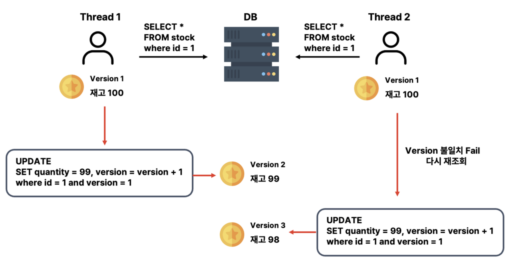
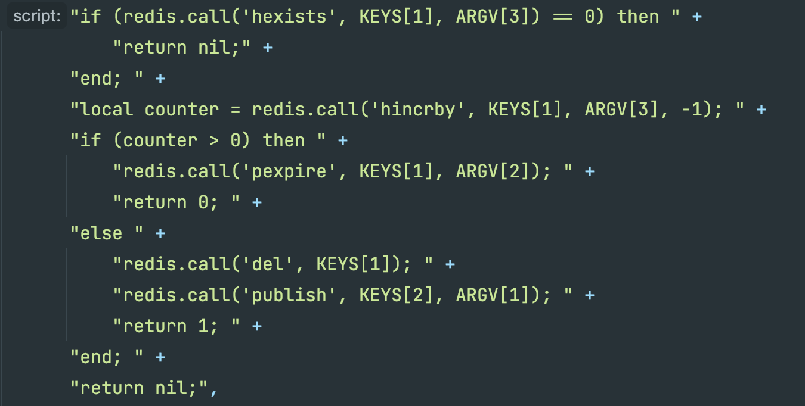

### 동시성 이슈란?

- 동시에 많은 요청으로 인해 공유 자원에 대해 **경쟁 상태(Race Condition)**이 발생하여 데이터 정합성에 문제가 생기는 상황을 말한다.
- **경쟁 상태(Race Condition):** 둘 이상의 Thread가 공유 자원에 접근해서 동시에 변경을 할 때 발생하는 문제

### 동시성 제어란?

- 동시에 실행되는 여러 개의 트랜잭션이 작업을 성공적으로 마칠 수 있도록 트랜잭션의 실행 순서를 제어하는 기법
- 동시성 제어의 목적
    - 트랜잭션의 직렬성 보장
    - 공유도 최대, 응답 시간 최소, 시스템 활동의 최대 보장
    - 데이터의 무결성 및 일관성 보장

## 동시성 제어를 위한 여러가지 방법

### 프로세스(언어단)에서 제어

1. 다양한 프로그래밍언어에서는 프로세스에 여러 스레드가 접근하는 것을 방지하기위한 thread-safe한 기능들을 제공
    1. 데이터에 동시에 하나의 스레드만 접근이 가능하도록 하는 것으로 가장 간단한 방법
    2. **Java:** Synchronized 키워드를 통해 데이터에 하나의 스레드만 접근이 가능하도록 만들어준다.
    3. **문제점**
        1. 하나의 스레드만 접근이 가능하다는 조건이 하나의 프로세스에서만 보장되는 특징이 있다.
        2. 이로인해, 부하 분산을 위해 서버를 확장할 경우 동시성을 보장하지 못한다.

### DB에서의 제어

1. **비관적 락(Pessimisitc Lock)**
    1. 자원 요청시 동시성 이슈가 자주 발생할 것이라고 비관적으로 예상하여 락을 걸어버리는 방법
    2. 실제로 DB 단에 X-Lock을 설정해서 동시성을 제어하는 방법으로 DB단에서 해당 자원의 점유는 트랜잭션 단위로 수행
    3. 한 트랜잭션이 데이터에 접근하고 있으면 다른 트랜잭션은 조회나 쓰기를 금지
    
    ### 사용 방법 예시(Spring JPA)
    
    ```java
    interface StockRepository : JpaRepository<Stock, Long> {
        @Lock(LockModeType.PESSIMISTIC_WRITE) //이것으로 간단하게 비관적 락을 지정할 수 있음
        fun findStockById(id: Long): Stock?
    }
    ```
    
    - **LockModeType.PESSIMISTIC_WRITE**
        - SELECT ~ FOR UPDATE 쿼리가 실행
        - 이는 exclusive lock으로 한 트랜잭션에서 update가 완료되어 커밋할때까지 읽기, 쓰기가 모두 잠금된다.
    - **LockModeType.PESSIMISTIC_READ**
        - SELECT ~ FOR SHARE 쿼리가 실행
        - 이는 shared lock으로 쓰기만 잠금이 된다.
    
    ### **장점**
    
    - Race Condition이 빈번하게 일어난다면 낙관적 락보다 성능이 좋다.
    - DB 단의 Lock을 통해서 동시성을 제어하기 때문에 확실하게 데이터 정합성이 보장된다.
    
    ### 단점
    
    - DB 단의 Lock을 설정하기 때문에 한 트랜잭션 작업이 정상적으로 끝나지 않으면 다른 트랜잭션 작업들이 대기해야 하므로 성능이 감소할 수 있다.
    - 여러 테이블이 조인되어 있는 경우 데드락이 발생할 위험이 있다.
    - 잦은 락으로 처리량이 감소하므로 동시성 이슈가 거의 발생하지 않는다면 성능상 손해이다.
2. **낙관적 락(Optimistic Lock)**
    1. 동시성 이슈가 자주 발생하지 않을 것으로 낙관적으로 판단하여 모든 요청을 락 없이 처리하고 데이터 정합성 이슈가 발견되면 그때서야 롤백을 수행해 정합성을 맞춘다.
    2. 낙관적 락은 DB 단에 실제 Lock을 설정하지 않고, 버전을 관리하는 컬럼을 테이블에 추가해서 데이터 수정 시마다 맞는 버전의 데이터를 수정하는지를 판단하는 방식
        
        
        
        1. 2개의 스레드에서 동시에 DB에 접근하여 재고 100, Version이 1인 상품을 조회
        2. 스레드 1에서 먼저 조회한 상품에 대한 업데이트 (quantity -1, version + 1)
        3. 스레드 2에서 조회한 상품에 대해 업데이트 하려고 할 때 id가 1이고 version이 1인 상품은 존재하지 않으므로(이미 스레드 1에서 version 2로 업데이트) 예외 발생
        4. 예외를 잡아서 다시 DB에서 상품을 재조회하여 version 2인 상품을 업데이트 (quantity - 1, version + 1)
        5. 1~3번 과정은 스프링에서 어노테이션을 선언하면 자동으로 동작하지만, 4번 과정은 예외를 잡아서 다시 로직을 수행하도록 수동으로 코드를 구현해야 한다.
    
    ### 사용 방법 예시(Spring JPA)
    
    Repository를 사용하는 곳에서 Lock 관련 어노테이션을 추가
    
    ```java
    interface StockRepository : JpaRepository<Stock, Long> {
        @Lock(LockModeType.OPTIMISTIC) //낙관적 락을 지정할 수 있음
        fun findStockById(id: Long): Stock?
    }
    ```
    
    해당 엔티티에 version 컬럼 추가
    
    ```java
    @Entity
    public class Stock {
    
    	@Id @GeneratedValue(strategy = GenerationType.IDENTITY)
    	private Long id;
    
    	private Long productId;
    
    	private Long quantity;
    
    	@Version //추가한 버전 컬럼에 어노테이션 선언
    	private Long version;
    
    		...
    
    }
    ```
    
    ### 장점
    
    - DB 단에서 별도의 Lock을 설정하지 않기 때문에 하나의 트랜잭션 작업이 길어질 때 다른 작업이 영향받지 않아서 성능이 좋을 수 있다.
    
    ### 단점
    
    - 버전이 맞지 않아서 예외가 발생할 때 재시도 로직을 구현해야 한다.
    - 동시성 이슈가 자주 발생하면 재시도를 여러번 거칠 것이기 때문에 성능이 좋지 않다.
3. **네임드 락(Named Lock)**
    1. 네임드 락은 임의로 락의 이름을 설정하고, 해당 락을 사용하여 동시성을 처리하는 방식
    2. 네임드 락도 비관적 락과 마찬가지로 DB 단에서 Lock을 설정하여 동시성을 처리 하지만, 비관적 락은 테이블에 Lock을 설정하지만 네임드 락은 해당 테이블이 아닌 별도의 공간(메타데이터)에 지정한 이름의 Lock을 설정
    3. 네임드 락은 주로 분산 락을 사용하려고 할 때 많이 사용하는 방식
    
    ### 사용 방법 예시(Spring JPA)
    
    ```java
    public interface LockRepository extends JpaRepository<Stock, Long> {
    
    	//네임드 락의 이름, time out 시간을 설정
    	@Query(value = "select get_lock(:key, 3000)", nativeQuery = true)
    	void getLock(String key);
    
    	@Query(value = "select release_lock(:key)", nativeQuery = true)
    	void releaseLock(String key);
    }
    ```
    
    ### **네임드 락 사용 시 주의점**
    
    - 네임드 락을 설정하는 부분과 비즈니스 로직의 트랜잭션을 분리해야 한다.
    - 로직에 대한 트랜잭션 전파 수준을 REQUIRES_NEW로 설정하여 분리
    
    ### **장점**
    
    - Lock의 대상이 테이블, 레코드 같은 DB 객체가 아니라 따로 Lock을 위한 공간에 Lock을 설정하기 때문에 같은 Named Lock을 사용하는 작업 이외의 작업은 영향 받지 않는다.
    
    ### **단점**
    
    - 트랜잭션 종료 시에 Lock 해제, 세션 관리 등을 수동으로 처리해야 하기 때문에 구현이 복잡할 수 있다.
    - DB에서 락을 관리하기 때문에 DB에 부담이 여전히 존재한다.
    - 락 획득 시도는 스핀락으로 구현해야하기 때문에 WAS에도 부담이 존재한다.
    

### Redis를 활용한 제어

1. **SETNX를 활용한 스핀 락**
    1. 락을 사용할 수 있을 때 까지 지속적으로 확인하며 기다리는 방식을 말한다. 즉, 레디스 서버에 지속적으로 SETNX 명령을 보내어 임계 영역 진입 여부를 확인하는 매커니즘이다.
    2. **SETNX:** Redis 명령어의 일종으로 “SET if Not eXists” 의 줄임말로, 말 그대로 특정 Key에 Value가 존재하지 않을 때만 값을 설정할 수 있다는 의미
    
    ```java
    @Transactional
    public EventTicketResponse createEventTicket(final Long eventId) throws InterruptedException {
        while (!redisLockRepository.lock(eventId)) {
            Thread.sleep(100);
        } // 락을 획득하기 위해 대기(락이 잠겨있다면 대기)
    
        try {
            Event event = eventRepository.findById(eventId).orElseThrow();
            if (event.isClosed()) {
                throw new RuntimeException("마감 되었습니다.");
            }
    
            EventTicket savedEventTicket = eventTicketRepository.save(new EventTicket(event));
            return new EventTicketResponse(savedEventTicket.getId(), savedEventTicket.getEvent().getId());
        } finally {
            redisLockRepository.unlock(eventId);
            // 락 해제
        }
    }
    ```
    
    ### 장점
    
    - 기본적으로 사용하는 redis client만으로 간단히 구현할 수 있다.
    
    ### 단점
    
    - 계속 무한 반복문을 돌며 임계 영역을 확인해야 하기 때문에, redis 서버에 부하를 줄 수 있다.
2. **Redis의 Message Broker 기능을 활용한 분산 락**
    1. 락을 해제하는 측(publisher)이 락을 대기하는 프로세스(subscriber)에게 ‘락 획득 시도를 해도된다’ 라는 메시지를 발행하고, 락을 대기하는 프로세스(subscriber)는 메세지가 수신되면 락 획득을 시도하는 방식
    2. Redisson 이라는 라이브러리가 Redis의 메시지 브로커 기능을 활용하여 분산 락 매커니즘을 구현
    3. **Redisson:** redis에서 분산락을 효율적으로 처리할 수 있도록 도와주는 오픈소스. pub/sub과 Lua 스크립트를 활용해 효과적으로 분산락을 처리하는 기능을 제공
    4. **Lua 스크립트:** redis의 명령어 집합을 원자적으로 실행할 수 있도록 하는 것
        
        
        
        위는 Redisson의 unlock 과정의 한 코드
        
        1. 특정 해시키를 가진 락을 조회하고 1을 감소한다.
        2. counter 결과가 0이면 키를 삭제한다.
        3. publish 명령으로 채널의 메시지를 전송한다.
    
    ### 사용법 예시(Spring)
    
    ```java
    @Transactional
    public EventTicketResponse createEventTicket(final Long eventId) {
        RLock lock = redissonClient.getLock(lockName);
    
        try {
    		    //첫 번째 매개변수 10은 락 획득을 위해 기다리는 시간
    		    //두 번째 매개변수 1은 락을 최대 임대하는 시간
            boolean available = lock.tryLock(10, 1, TimeUnit.SECONDS);
    
            if (!available) {
                throw new RuntimeException("Lock을 획득하지 못했습니다.");
            }
    
            /* 비즈니스 로직 */
            ...
            /* 비즈니스 로직 */
        } catch (InterruptedException e) {
    		    //락을 얻으려고 시도하다가 인터럽트를 받았을 때 발생하는 예외
            throw new RuntimeException(e);
        } finally {
            lock.unlock();
        }
    }
    ```
    
    > Spring Webflux 환경에서는 제대로 동작을 안하는 듯(잘 모름)
    > 
    
    ### 장점
    
    - 무한 반복문을 돌면서 계속 확인하는 방식이 아니므로 쓸데없는 트래픽이 발생하지 않는다.
    
    ### 단점
    
    - 키가 존재하고 키에 저장된 값이 클라이언트의 값과 일치하는 경우에만 잠금이 해제. 하지만 이러한 방식으로 구축된 redis 노드는 단일 장애 지점(SPOF, Single Point Of Failure)이 발생
    - 이를 위해 Master-Slave 복제(replication) 모드로 redis 서버를 구축하더라도 redis의 복제는 비동기식이기 때문에 상황에 따라 경쟁 상태(race condition)가 발생할 수 있다.
    - 이를 해결하기 위해 Redisson에서는 분산 락 알고리즘 구현으로 Redlock 알고리즘을 사용
    - Redisson 내부 구현체의 알고리즘(Redlock)의 한계로 인한 문제가 발생할 수 있음
    
    ### **Redlock 알고리즘 요약**
    
    - N대의 싱글 노드 레디스가 존재함
    - 클라이언트에서 잠금을 위해 N대의 노드에 동시 요청(setnx)를 보냄
    - N대 중 N/2 + 1의 잠금을 획득했다면, 분산락 획득에 성공하게 됨
    - 만약 실패했다면, 모든 N대의 노드에 해제 요청(delete)을 보냄
    - random interval 이후에 재시도함
    
    ### **Redlock 알고리즘의 한계**
    
    - **Clock Drift로 인한 문제**
        - RedLock 알고리즘은 노드들 간에 동기화된 시계는 없지만, 로컬 시간이 거의 동일한 속도로 갱신된다는 가정에 의존한다. 하지만 현실에서는 클럭이 정확한 속도로 동작하지 않는 클럭 드리프트(Clock Drift) 현상으로 인해 레드락 알고리즘에 문제가 생길 수 있다.
        - 문제 상황
            1. 클라이언트 1이 노드 A, B, C에서 잠금을 획득하지만, 네트워크 문제로 인해 D와 E에서는 잠금 획득에 실패한다.
            2. 이때 노드 C의 시계가 앞으로 이동하여 잠금이 만료된다.
            3. 클라이언트 2가 노드 C, D, E에서 잠금을 획득하지만, 네트워크 문제로 인해 A와 B에서는 잠금 획득에 실패한다.
            4. 이제 클라이언트 1과 2는 모두 자신이 잠금을 획득했다고 믿는다.
    - **애플리케이션 중단 또는 네트워크 지연으로 인한 문제**

### 비관 락/낙관 락과 Redis 분산락의 사용 상황에 따른 차이

비관 락/낙관 락의 관심사는 특정 엔티티에 대한 동시 접근 제어이다. 즉, 동시성을 제어하기 위한 엔티티가 존재해야한다. 하지만 만약, 엔티티의 생성 개수 제한에서 문제가 발생하였다면 이는 이미 존재하는 엔티티에 동시 접근하는 상황이 아니므로 낙관 락/비관 락으로 해결할 수 없다.

물론 남는 수에 대한 정보를 별도 관리한다면 비관 락/낙관 락으로 해결할 수 있다.

### 참고

- https://mangkyu.tistory.com/311
- https://ksh-coding.tistory.com/125
- https://hudi.blog/distributed-lock-with-redis/
- [https://velog.io/@yellowsunn/동시성-이슈를-해결하는-다양한-방법](https://velog.io/@yellowsunn/%EB%8F%99%EC%8B%9C%EC%84%B1-%EC%9D%B4%EC%8A%88%EB%A5%BC-%ED%95%B4%EA%B2%B0%ED%95%98%EB%8A%94-%EB%8B%A4%EC%96%91%ED%95%9C-%EB%B0%A9%EB%B2%95)
- https://jokerkwu.tistory.com/125
- [https://velog.io/@a01021039107/분산락으로-해결하는-동시성-문제이론편](https://velog.io/@a01021039107/%EB%B6%84%EC%82%B0%EB%9D%BD%EC%9C%BC%EB%A1%9C-%ED%95%B4%EA%B2%B0%ED%95%98%EB%8A%94-%EB%8F%99%EC%8B%9C%EC%84%B1-%EB%AC%B8%EC%A0%9C%EC%9D%B4%EB%A1%A0%ED%8E%B8)
