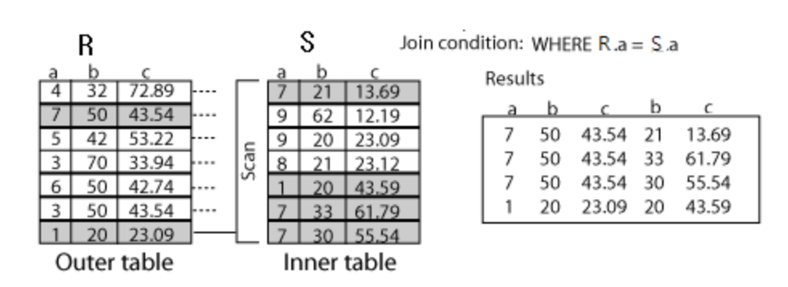
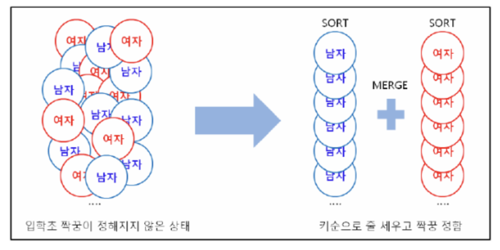

## MySQL

MySQL은 세계에서 가장 많이 쓰이는 무료의 오픈 소스 관계형 DBMS이다.

### 장점

- MySQL은 오직 1MB의 RAM만 사용할만큼 용량 차지가 적기 때문 , 매우적은 오버헤드를 사용
- 처리속도가 빠르고 대용량 처리에 용이함
- 다른 데이터 관리 툴에 비해 구조가 간단하여 사용하기가 매우 쉽다.
- 유연하고 확장이 가능한 구조이다.
- 다양한 소프트웨어와 쉽게 통합될 수 있다.
- 거의 모든 운영체제 사용을 지원한다.
- 무료라서 비용적인 부담이 적다.

### 단점

- 복잡한 쿼리는 성능저하
- 트랜젝션 지원이 완벽하지 않다.
- 사용자정의 함수의 사용이 쉽지 않고 유연하지 않다.

### 사용처

MySQL은 더 가볍고 경제적인 솔루션을 찾는 사용자에게 적합하다. 특히, 중소기업, 스타트업 및 온라인 쇼핑몰에 인기가 많다. 이는 MySQL이 제공하는 빠른 개발 시간, 비용 효율성, 간단한 관리 때문

## OracleDB

현재 리눅스/유닉스 체제에서 가장 많이 사용되는 세계 점유율  1위의 DBMS이다.

### 장점

- 관리 시스템
    - Multiple database 튜닝 가능하다.
    - 다수의 사용자가 동시에 접근이 가능하다.
- 변화관리
    - 변경 plan을 작성하고 실제 구현하기 전에 변경 사항의 효과를 볼 수 있다.
    - 생산 시스템을 방해하지 않는다.
- 경고
    - 오류가 발생하면 설정되어 있는 계정 및 이메일로 연락이 온다.
    - 경고는 예정된 정지 시간동안 차단할 수도 있다.
    - 그 외 다중 마스터 복제, 고급 보안 옵션 등과 같은 고급 기능을 지원
- 분산처리
    - DBMS 실행 컴퓨터 / 서버 역할 컴퓨터 / DB 응용 프로그램 실행 컴퓨터를 다르게 분산 처리된다.
- 처리
    - 쿼리 최적화 프로그램 (SQL문을 실행하는 가장 효율적인 방법 선택)
    - 고성능 트랜잭션 처리를 제공하여 속도가 빠르다.
        - Oracle은 전체 시스템의 성능을 높게 유지하면서 고성능 트랜잭션 처리를 제공하므로 데이터베이스 사용자들은 느린 처리 속도로 고생하지 않아도 된다.
- 성능
    - 대규모 데이터베이스를 지원하여 대량의 정보관리를 할 때에 가장 좋은 성능을 보인다.

### 단점

- 비용적인 부담이 크다.
- 기능이 많아 초보자에게 어렵다.
- 높은 지원 하드웨어 사양이 필요하다.

### 사용처

Oracle은 주로 금융 기관, 대형 소프트웨어 회사, 정부 기관 등에서 선호된다. 왜냐하면 이러한 기관들은 복잡한 트랜잭션, 이중화, 고가용성과 같은 고급 기능을 요구하기 때문

## 비교

### **구조적 차이**

- **Oracle:** DB 서버가 통합된 하나의 스토리지를 공유하는 방식
- **MySQL:** DB 서버마다 독립적인 스토리지를 할당하는 방식

### **조인 방식의 차이**

- **Oracle:** 중첩 루프 조인, 해시 조인, 소트 머지 조인 방식을 제공
- **MySQL:** 중첩 루프 조인 방식을 제공
    
    ### 1. 중첩 루프 조인(Nested Loop Join)
    
    
    
    중첩 루프 조인은 쿼리에서 가장 일반적이고 흔한 조인 방식이다. 소량의 데이터를 처리하거나 부분범위 처리에 적합하다. 이 조인 방식은 For문을 중첩으로 사용해 조인 한다고 생각하면 된다.
    
    WHERE 절에 있는 조건에 따라 한 테이블을 기준으로 다른 테이블과 조인을 시도하는데 기준이 되는 테이블을 드라이빙 테이블(Driving Table) 혹은 Outer 테이블이라고 부르며, 나머지 하나의 테이블은 드라이븐 테이블(Driven Table) 혹은 Inner 테이블이라고 부른다.
    
    Optimzer가 드라이빙 테이블의 한 로우를 읽어 해당 로우를 찾고 이 값을 기준으로 드라이븐 테이블에서 같은 값을 검색한다. 검색이 완료되면 다음 로우를 진행하고 이러한 방식으로 조인을 하는 것을 중첩 루프 조인이라고 한다.
    
    드라이븐 테이블(Driven)에 조인 속성에 인덱스가 존재할 경우에는 **Single Loop Join**을 사용
    
    - 첫 번째 로우를 받는 시간은 빠르지만, 전체 결과를 받기까지 시간이 걸린다.
    - 메모리가 필요없다.
    - 드라이빙 테이블의 선택이 중요하다(가장 적은 데이터를 가지고 있는 테이블을 드라이빙 테이블로 지정)
    - inner 테이블 검색시 인덱스를 사용하기 때문에 inner 테이블의 index 효율이 좋아야 한다.
    - 드라이빙 테이블 검색에는 full table scan 혹은 index scan 방식을 사용한다.
    - 순차적으로 처리하며, Random Access 위주
    - 쿼리 수행결과가 전체 로우의 15% 이하 일 때 사용한다.(주로 좁은 범위에 유리)
    - Oracle의 경우 조인 조건에 "=" 연산자가 사용될 경우 optimizer는 NLJ를 선택한다.
    - **사용법**
        
        힌트: /*+ USE_NL(A B) */
        
        ```sql
        select /*+ use_nl(b,a) */ a.dname, b.ename, b.sal
        from emp b, dept a
        where a.loc = 'NEW YORK'
        and b.deptno = a.deptno
        ```
        
    
    ### 2. 소트 머지 조인(Sort Merge Join)
    
    
    
    Sort Merge 조인은 메모리를 사용. 조인 실행시 조건에 해당하는 두 테이블을 각각 정렬을 시켜 만들어 놓은 후 한 번에 합치는 조인 방법이다. 조인 절에 index가 없을 때 자주 사용되며 주로 대량의 데이터를 조회할 때 적합하다.
    
    두 레코드들을 모두 조인 애트리뷰트의 순서에 따라 동시에 스캔하면서 A, B 값이 동일한 레코드를 검색
    
    - NLJ와 다르게 드라이빙 테이블이 필요없다. 두 테이블 모두 동등 레벨
    - 첫 번째 로우를 받는 시간은 느리지만, 전체 로우가 반환되는 시간은 빠르다.
    - 정렬을 위해 추가 메모리를 사용한다. SORT_AREA_SIZE 파라미터에 명시. 명시된 값 이상의 메모리 사용시 디스크 I/O 발생
    - NLJ보다 많은 양의 데이터 처리시 유리하다.
    - 정렬을 위한 영역(Sort Area Size)에 따라 효율에 큰 차이가 남
    - 메모리만 이용해 정렬 작업할 경우 넓은 범위의 값을 검색하는데 유리
    - 조인의 대상 범위가 넓을 때 발생하는 랜덤 액세스를 줄이기 위한 경우나 연결고리에 마땅한 인덱스가 존재하지 않을 때 해결하기 위한 대안
    - 두 결과집합의 크기가 차이가 많이 나는 경우에는 비효율적
    - 정렬 작업이 전체 성능에 영향을 미치므로 SELECT 절에서 불필요한 컬럼은 제거해 정렬 작업에 부하를 줄이는 게 좋다.
    - 조인 조건에 >, >=, <=, <와 같은 비동등 연산자가 사용될 경우 optimizer는 SMJ를 선택한다.
    - **사용법**
        
        힌트: /* USE_MERGE(A B) */
        
        ```sql
        select /*+ use_merge(a b) */a.dname, b.empno, b.ename
        from   dept a,emp b
        where  a.deptno = b.deptno
        and    b.sal > 1000 ;
        ```
        
    
    ### 3. 해시 조인
    
    
    
    두 테이블 중 WHERE 조건에 의해 필터링 된 로우수가 적은 테이블을 대상으로 해시 테이블을 생성한 후, 조인 조건에 따라 다른 하나의 테이블의 데이터를 검색하는 방식이다.
    
    메모리에 해시 테이블을 생성하고, 해시 함수를 이용해 연산 조인을 하기 때문에 CPU 사용이 증가할 수 있으므로 조회 빈도가 높은 온라인 프로그램에는 적합하지 않는 조인 방식이다.
    
    - Nested Loop 조인과 Sort Merge 조인의 문제점을 해결
    - 대용량 처리의 선결조건인 랜덤 액세스와 정렬에 대한 부담을 해결할 수 있는 대안으로 등장
    - 해시 테이블을 만든다는 것을 제외하면 NLJ와 비슷하다.
    - 해시 테이블이 드라이빙 테이블이 되어 NLJ를 수행한다고 보면 된다.
    - HASH_AREA_SIZE에 지정된 메모리 값 내에서 해시 테이블이 생성되므로 테이블의 크기가 이 값 내에 있을 경우에 유리하다.(일반적으로 HASH_AREA_SIZE는 SORT_AREA_SIZE의 두 배)
    - 대용량 데이터 처리에서는 상당히 큰 hash area를 필요로 함으로, 메모리의 지나친 사용으로 오버헤드 발생 가능성이 있다.
    - 해시 대상의 테이블을 드라이빙 테이블(driving table) 또는 빌드 테이블(build table)이라고 한다.
    - 조인 조건에서 동등조건 "="이 사용되었을 때 사용이 가능하다.
    - 반환되는 로우 수가 적은 테이블(**이 테이블을 대상으로 해서 해시 테이블을 생성**)과 이에 반해 반환되는 로우수가 상당히 많은 테이블을 조인시 유리하다.
    - **사용법**
        
        힌트: /*+ USE_HASH(A B) */
        
        ```sql
        select /*+ use_hash(a b) */ a.dname, b.empno, b.ename
        from dept a, emp b
        where a.deptno = b.deptno
        and a.deptno between 10 and 20;
        ```
        
    

### **확장성의 차이**

- **Oracle:** 별도의 DBMS을 설치해 사용할 수 없음
- **MySQL:** 별도의 DBMS을 설치해 사용할 수 있음

### **메모리 사용율의 차이**

- **Oracle:** 메모리 사용율이 커서 최소 수백MB 이상이 되어야 설치 가능
- **MySQL:** 메모리 사용율이 낮아서 1MB 환경에서도 설치가 가능

### 힌트 방식

- **Oracle:** 힌트에 문법적 오류가 있으면 힌트를 무시하고 쿼리를 수행한다.
- **MySQL:** 힌트에 문법적 오류가 있으면 오류를 발생시킨다.

### 참고(출처)

https://swkn.tistory.com/76

[https://velog.io/@alicesykim95/Oracle과-MySQL의-차이점](https://velog.io/@alicesykim95/Oracle%EA%B3%BC-MySQL%EC%9D%98-%EC%B0%A8%EC%9D%B4%EC%A0%90)

https://mantaray.tistory.com/38

https://bny9164.tistory.com/88

https://blog.naver.com/agopwns/221161172593

http://www.jidum.com/jidums/view.do?jidumId=167
