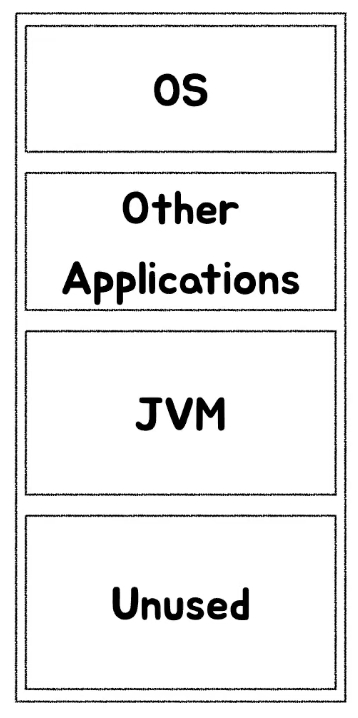
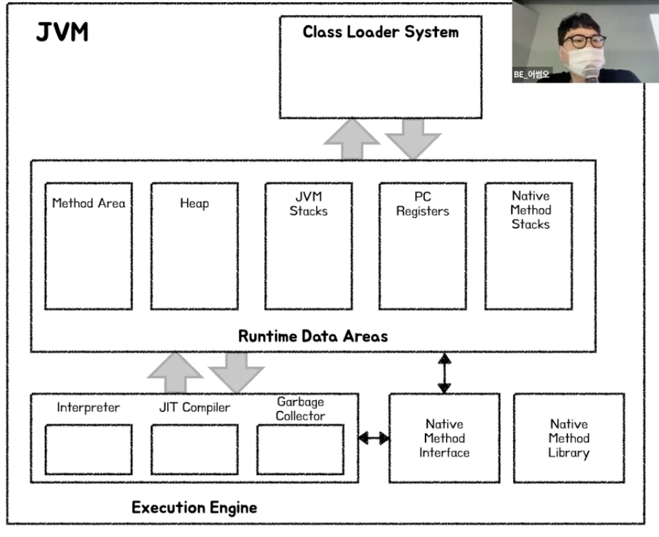
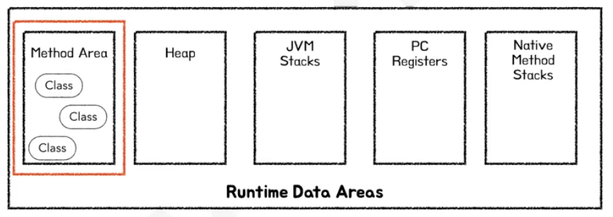
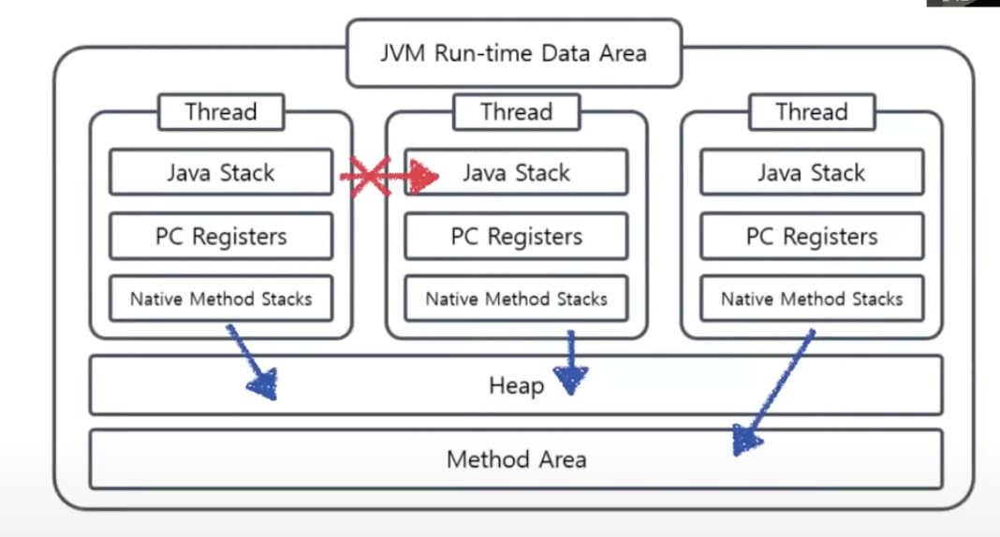
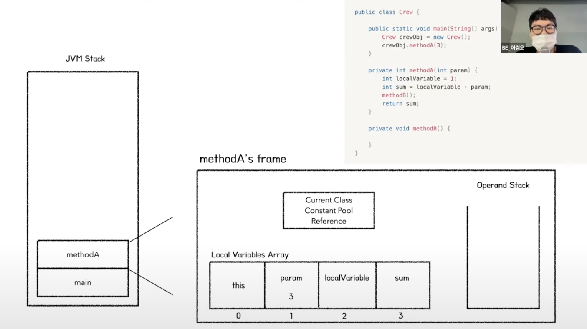
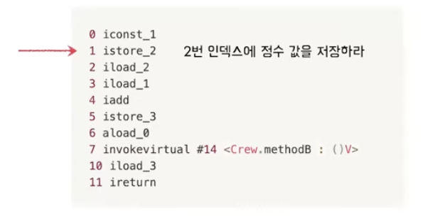
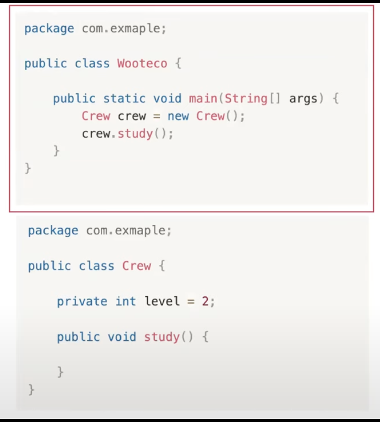
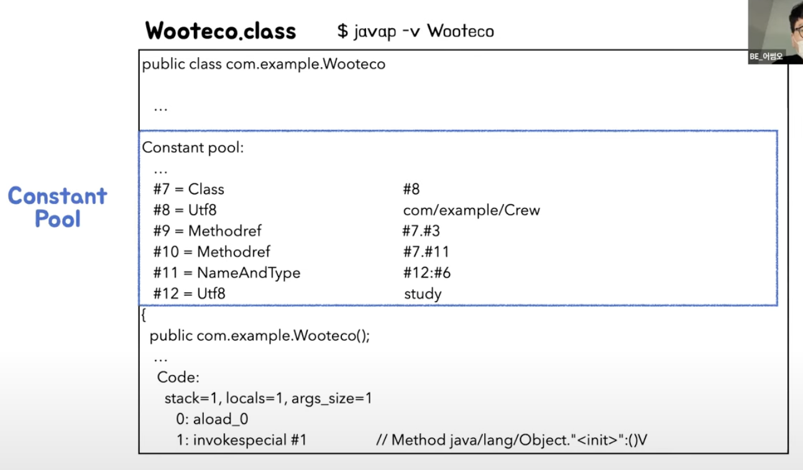

# JVM 추가 질문 정리

#### 1. GC와 관련하여 자바에서 내부 클래스를 선언할 때 static 으로 해야하는 이유

```java
public class Outer {
    class Inner {
        void display() {
            System.out.println("Inner class");
        }
    }
}
```

- 비정적인 내부 클래스는 외부 클래스의 인스턴스에 대한 숨겨진 참조를 하고 있기 때문에 Outer 클래스의 인스턴스가 존재하는 한 Inner 클래스의 인스턴스는 GC의 대상이 되지 않음. 따라서 필요하지 않은 메모리가 해제되지 않는 상황이 발생하여 메모리 누수가 발생.

```java
public class Outer {
    static class Inner {
        void display() {
            System.out.println("Static Inner class");
        }
    }
}
```

- Inner 클래스가 정적으로 선언되어 있기 때문에 Outer 의 인스턴스에 대한 참조를 가지지 않음. 따라서 Outer 클래스의 인스턴스와는 독립적으로 존재할 수 있음. 외부 클래스와 독립적인 생명 주기를 가지며 GC가 발생할 때 불필요한 참조로 인한 메모리 누수가 발생하지 않음. 


#### - 요약

- **비정적 내부 클래스가 외부 클래스의 인스턴스를 참조하는 구조로 인해 Eden 영역에서 객체가 Survivor 영역으로 이동할 때, 외부 클래스 인스턴스가 불필요하게 남아있을 수 있어 메모리 누수를 초래할 수 있고, GC의 효율성을 떨어뜨림.** 

---

###  ✔ Java8 로 변하며 PermG 영역이 사라지고 MetaSpace가 생겼다

- JAVA 7의 JVM


- JAVA 8의 JVM


- PermG 영역의 고정된 크기 때문에 OOM 문제를 해결하고자.
- MetaSpace는 시스템의 네이티브 메모리를 사용하여 클래스 메타데이터를 저장. 필요에따라 동적으로 확장될 수 있기 때문에 위 문제 해결. (OS 레벨에서 관리)
  - Class의 메타데이터, Method의 메타데이터, Class와 관련된 배열 객체 메타데이터, JVM 내부 객체들과 JIT의 최적화 정보 저장
  - **static 객체, 변수 및 String Object -> Heap 에 저장** (기존 PermG)
- **static 변수 및 객체도 Heap 에 저장되기 때문에 GC의 대상이 되긴 함.**
- 그러나 Class 가 JVM 에 로드될 때 Static 변수 및 객체가 생성되고, **해당 클래스가 메모리에 남아있는 한 static 변수 및 객체를 계속해서 참조**하고 있기 때문에 실질적으로 GC의 대상이 아니라고 볼 수 있음. 
- 결론적으로 클래스의 생명 주기와 직접 연관되어 클래스가 메모리에 로드되어 있는 한 static 도 유지됨. 
- 일반적으로 커스텀 클래스 로더를 통해 클래스 로더의 생명 주기를 직접 관리하거나 특정 조건 하에서 클래스를 직접 언로드 하지 않는 이상 보통의 JVM의 클래스 로더는 한 번 로드한 클래스를 클래스 로더가 언로드 되지 않는 이상 언로드 할 수 없음. 그렇기 때문에 로드된 클래스는 재배포 하거나 JVM이 종료되는 시점에 클래스 로더가 언로드 되는 경우를 제외하고는 JVM의 메소드 영역에 보관되며 계속 유효하게 유지됨.  

#### 2. "Hello" 와 new String("Hello")은 각각 어느 메모리 영역에 저장되나요? 만약 그 둘이 다르면 왜 String를 저장하는 방법은 일반적인 참조형 객체를 저장하는 방법과 다른가요?


- String 으로 생성한 문자열 `"Hello"` 는 Heap 영역 내에 String Pool에 저장되어 재사용됨.
- 그러나 `new String("Hello")` 는 같은 내용이라도 여러 개의 객체가 각각 생성되어 Heap 영역을 차지하게 됨. 

```java
public class StringExample {
    public static void main(String[] args) {
        String str1 = "Hello";          // String 리터럴
        String str2 = "Hello";          // String Pool에서 동일한 객체를 참조

        String str3 = new String("Hello");  // 새로운 String 객체 생성
        String str4 = new String("Hello");  // 또 다른 새로운 String 객체 생성

        // str1과 str2는 동일한 객체를 참조
        System.out.println(str1 == str2);   // true

        // str3과 str4는 서로 다른 객체를 참조
        System.out.println(str3 == str4);   // false

        // 문자열 값은 동일함
        System.out.println(str3.equals(str4)); // true
    }
}
```

- **메모리를 효율적으로 사용하기 위해서는 String literal 로 String 을 생성하는 것이 좋다 !!!**


#### 3. JVM은 단순히 자바 언어를 해석하기 위해 존재하는 것인데 자바 외의 언어로 작성된 코드를 위한 메모리 영역이 왜 존재하게 되는건가요?

- JVM 은 자바 프로그램을 실행하기 위해 만들어졌지만 자바로만 작성된 코드가 아니라 성능이나 기존의 레거시 시스템과의 통합을 위해 네이티브 코드와 상호작용이 필요할 수 있음. (운영체제 혹은 라이브러리와 상호작용)
- 네이티브 코드를 호출하기 위해 JNI 를 사용함. 이 과정에서 **네이티브 메서드의 구현과 관련된 메타데이터 및 코드가 네이티브 메서드 영역에 저장됨.**

####	📌 JNI (Java Native Interface)

- 다른 언어들로 작성된 라이브러리들을 호출하거나 반대로 호출되는 것을 가능하게 하는 프로그래밍 프레임워크


#### 4.  각각의 Area에 할당된 메모리 사이즈가 어떻게 될까요?

- JVM 설정 및 시스템에 따라 달라질 것 같습니다 !


#### 5. 컴파일과 빌드는 다른 것인가요? gradle이나 maven이 하는 역할을 말해주시고, jar 파일에 대해서 class와 비교하여 말씀해주세요

##### (1) 컴파일

- 소스 코드를 기계가 이해할 수 있는 바이트 코드로 변환하는 과정.
- `.java` 파일을 `.class` 파일로 변환하는 과정

##### (2) 빌드

- 소스 코드를 실행 가능한 프로그램으로 만들기 위한 일련의 작업. 
- 컴파일, 테스트, 패키징 배포 등이 포함됨. 
  - 종속성 다운로드 - **전처리(Preprocessing)**
  - 소스코드를 바이너리 코드로 **컴파일(Compile)**
  - 바이너리 코드를 **패키징(Packaging)**
  - **테스트** 실행(Testing)
  - 프로덕션 시스템에 **배포(distribution)**
- `.jar` `.war` 파일 생성


#### (3) gradle과 maven

- 빌드 관리 도구 
- Maven 은 `pom.xml` 파일을 통해 프로젝트 설정 및 의존성 관리를 진행.
- Gradle 은 `build.gradle` 파일을 통해 프로젝트 설정 및 의존성 관리 진행. 

-  차이점 추가 정리 필요


##### (4) JAR 와 `.class`

- `.class`
  - 자바 컴파일러에 의해 컴파일된 바이트 코드. 각 클래스 마다 하나의 `.class` 파일이 생성됨 
- `.jar`
  - 여러 개의 클래스 파일과 관련 리소스 파일(이미지, 텍스트 등) 을 포함하는 압축된 파일 


---

#### 📍 어썸오의 JVM Memory Layout 테코톡 정리

### 📌 JVM 이란 ?

- Java Byte Code를 운영체제에 맞게 해석해주는 역할
- 작성한 자바 프로그램의 실행 환경을 제공하는 자바 프로그램의 구동 엔진 
- Java Compiler 는 `.java` 파일을 `.class` 라는 자바 바이트 코드로 변환시켜준다. 하지만 바이트 코드는 기계어(Native Code)가 아니므로 OS에서 바로 실행이 되지 않는데, 이 때 JVM은 OS가 Byte Code를 이해할 수 있도록 해석해주는 역할을 한다. 
- **JVM 을 사용하면 하나의 바이트코드로 모든 플랫폼에서 동작하도록 할 수 있다.** 
- JVM 은 **메모리 관리**도 담당한다. 이를 **가비지 컬렉터(GC)**라고 한다. 


## JVM Memory Layout
- 목적 : 자바 코드를 실행할 때 JVM 런타임 데이터 영역에서 어떤 일이 일어나는지 이해하기
- 발표 대상
1. JVM이 무엇이고 왜 필요한지 대략적으로 아는 사람
2. 바이트코드가 무엇인지 알고 한 번이라도 본 적 있는 사람
3. 자바 코드가 실행될 때 JVM 안에서 구체적으로 어떤 일이 일어나는지 궁금한 사람

- **컴퓨터 메모리 구조 레이아웃**

### 1. JVM의 구조
- java 소스코드를 작성하고 java 컴파일러를 통해 컴파일을 하면 `.class` 파일이 생성이 됨. 


- java 명령어로 class 파일을 실행하면, JVM은 class loader를 통해 이 클래스를 읽어들임.
- 클래스 파일 안에는 클래스 안에 어떤 필드가 몇 개 선언 되어있는지, 메서드는 몇 개이고 이름은 무엇인지, 바이트코드까지 포함한 클래스의 모든 정보를 담고 있음. 

- **Class Loader System**은 클래스 파일 정보를 Method Area 에 올리고, static 변수 등을 초기화 하는 역할을 함. 
- **Runtime Data Area**는 JVM이라는 가상 머신이 사용하는 메모리 공간 

- **바이트코드**란 JVM이 알아들을 수 있는 명령어들의 집합을 의미.
- JVM의 목적은 바이트 코드를 기계어로 번역해서 CPU에게 일을 시킴. 
- 바이트 코드를 기계어로 번역하는 일을 **Interpreter**가 실행함.
### 2. Runtime Data Area

1. Method Area 
	1. 클래스에 대한 모든 정보가 저장되는 영역 
2. Heap
	1. 런타임에 생성되는 모든 객체들이 저장됨. 
	2. GC가 동작하는 곳
3. JVM Stacks 
	1. 메서드를 실행하기 위한 정보들이 저장되는 공간 
	2. Frame 이라는 자료 구조가 존재.
	3. Frame은 메서드가 하나 호출될 때 마다 새로 생기고, 메서드가 끝나거나 예외가 발생하면 사라진다. 
4. PC Registers
	1. 현재 실행되고 있는 명령어의 주소를 저장하는 곳. 
	2. 멀티스레드 프로그래밍 환경에서 한 스레드가 작업을 하다가 다른 스레드로 잠시 cpu 점유를 넘겨주고 다시 돌아왔을 때 이전 작업을 저장하기 위한 영역
5. Native Method Stacks
	1. C나 C++로 작성된 메서드를 실행할 때 사용되는 스택 
	
- Method Area와 Heap 영역은 모든 스레드가 공유하는 영역이기 때문에 멀티 스레드 환경에서 동기화에 유의해야 함. 
- JVM Stacks, PC Registers, Native Method Stacks 는 스레드가 생성될 때 마다 새로 생기는 영역들로, 서로 다른 스레드 간 침범할 수 없음.
	- 그래서 하나의 메서드 안에서 다른 메서드의 지역 변수의 동시성 문제를 걱정하지 않아도 됨. 
### 3. JVM Stack

- 프레임 내에는 현재 클래스의 컨스턴트 풀에 대한 참조, 지역 변수 배열, Operand Stack이 있음.
- 지역 변수 배열은 메서드 내의 지역변수들을 담고 있는 배열. 
- 인스턴스 메서드는 항상 제일 첫 번째 인덱스에 현재 인스턴스에 대한 참조를 가지고 있음. 
- Method A는 인스턴스 메서드이기 때문에 자기 자신에 대한 참조 this 를 갖고 있음. 
- **Operand Stack**
	- jvm은 스택 기반으로 연산 수행
	- 피연산값 혹은 연산의 중간값을 저장하기 위한 자료 구조 

#### * 바이트코드


### 4. Method Area & Heap



#### *Constant pool (상수 풀)
- 클래스 내에 사용되는 상수들을 담은 테이블 

- 8번 인덱스 처럼 참조하는 대상의 이름만을 String으로 지칭하는 것을 **Symbolic Reference** 라고 함. 이 값이 Crew 데이터의 값을 가리키는 포인트로 사용됨. 
- 이게 Crew Class 를 Class Loader 를 통해 Method Area로 읽어오면서 Crew Class 를 가리키는 참조값을 변환됨. 


---

[어썸오의 JVM Memery Layout](https://www.youtube.com/watch?v=GU254H0N93Y)

[JNI (JAVA Native Interface)](https://velog.io/@vrooming13/JNI-JAVA-Native-Interface)

[Maven 과 Gradle](https://velog.io/@leesomyoung/Maven%EA%B3%BC-Gradle%EC%9D%98-%EC%B0%A8%EC%9D%B4-%EB%B0%8F-%EB%B9%84%EA%B5%90)