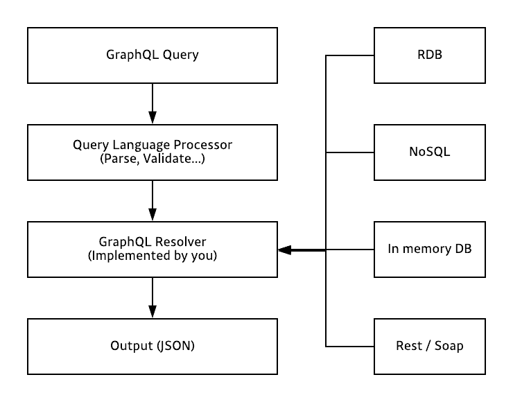
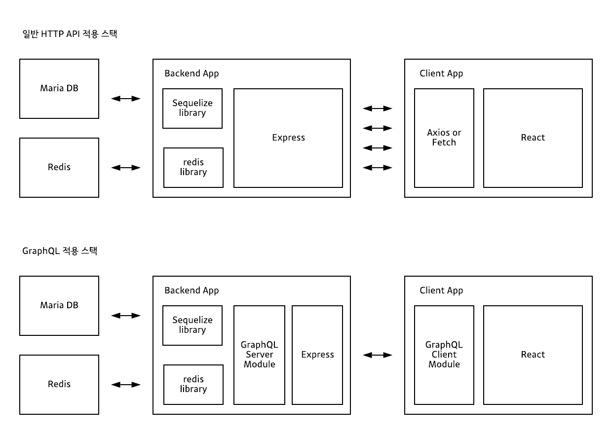

# REST API 질문 추가

**Q. REST api에 관하여 설명해보세요.**

REST api는 Rest 아키텍처 기반의 api입니다. REST는 Representational State Transfer로 자원을 이름으로 구분하여 자원의 상태를 주고 받는 것을 뜻합니다. 따라서 REST api는 HTTP URI를 통해 자원을 구분하고, HTTP Method를 통해 해당 자원에 CRUD 연산을 적용합니다.

HTTP를 기반으로 모든 플랫폼에서 동일한 방식으로 접근 가능한 일관된 인터페이스를 제공하기 때문에, 단일 Restful api로 모든 클라이언트를 지원 가능합니다. 또한 리소스를 다양한 형식으로 클라이언트의 요구에 맞게 데이터를 제공할 수 있어 유용합니다.

또한 REST api는 일관성, 서버-클라이언트 구조 기반 독립성, 무상태성, 캐시처리가 가능하다는 특징을 지닙니다.

_보충 Q. API는 무엇인가요?_

_api는 Application Programming Interface로 고유한 기능을 가진 두 애플리케이션 간의 서비스 계약입니다. 두 애플리케이션이 통신하는 방법을 정의합니다._

_SOAP 또는 XML-RPC와 같은 일부 API는 개발자에게 엄격한 프레임워크를 적용합니다. 그러나 개발자는 거의 모든 프로그래밍 언어를 사용하여 REST API를 개발할 수 있으며 다양한 데이터 형식을 지원합니다. 유일한 요구 사항은 아키텍처 제약 조건이라고도 하는 다음 6가지 REST 설계 원칙을 준수해야 한다는 것입니다._

_보충 Q. HTTP API와 REST API가 뭔가요?_

_HTTP API는 HTTP를 사용하여 프로그램끼리 소통하는 API를 말한다. 현재 대부분의 API가 HTTP 통신을 규칙으로 소통한다. (그래서 두 가지 용어를 혼용한다.)_

_엄밀히 말하면 REST는 네트워크 아키텍처 원리의 모음이며, 따라서 자원을 정의하고 자원에 대한 주소를 지정하는 방법 전반을 일컫는다. 이는 REST API가 REST 원리를 따르는 API의 모음임을 의미한다._

**Q. REST api가 아닌 api에 대해서도 알고 있나요?**

_++요즘은 GraphQL 도 많이 사용하더라구요 ! 추가적으로 학습하는 것도 도움될 것 같습니다 !_

- Soap API

  - 고도로 구조화 되어 있음
  - XML 데이터 형식을 사용함
    - XML : Extensible Markup Language(XML)를 사용하면 공유 가능한 방식
  - SOAP에서 사용하는 표준 종류의 예시
    - 웹 서비스 보안(WS-Security)은 고유 식별자로 *토큰*을 사용하는 것과 같은 보안 조치를 지정함
    - 웹 서비스 주소 지정(WS-Addressing)에는 라우팅 정보를 메타데이터로 포함해야 함
    - WS-ReliableMessaging은 SOAP 메시징의 오류 처리를 표준화함
    - 웹 서비스 기술 언어(WSDL)는 SOAP 웹 서비스의 범위와 기능을 설명함
  - SOAP vs REST API
    |                                                                                                            | SOAP                                                                          | REST                               |
    | ---------------------------------------------------------------------------------------------------------- | ----------------------------------------------------------------------------- | ---------------------------------- |
    | 설계                                                                                                       | 함수 또는 작업을 노출                                                         | 데이터 기반                        |
    | 유연성                                                                                                     | - 애플리케이션 간 XML 메시징만 허용                                           |
    | - 애플리케이션 서버는 각 클라이언트의 상태를 유지해야 함. 즉, 새 요청을 처리할 때 이전 요청을 모두 기억 必 | - 애플리케이션에서 일반 텍스트, HTML, XML 및 JSON으로 데이터를 전송           |
    | - REST는 무상태이므로 REST API는 모든 새 요청을 이전 요청과 독립적으로 처리                                |
    | 성능                                                                                                       | 크고 복잡 → 느린 전송 및 처리 속도                                            | 메시지 크기가 작음 → 빠르고 효율적 |
    | + 응답 캐싱 - 로드 시간 단축                                                                               |
    | 확장성                                                                                                     | 애플리케이션이 요청 간에 상태를 저장해야 하므로 대역폭과 메모리 요구사항 증가 |
    | - 애플리케이션 비용이 많이 들고 확장하기가 어려움                                                          | 무상태 및 계층화된 아키텍처를 허용하므로 확장성이 뛰어남                      |
    | 보안                                                                                                       | HTTPS와 함께 사용하려면 추가 WS-Security 계층이 필요                          |
    WS-Security는 추가 헤더 콘텐츠를 사용하여 지정된 서버의 지정된 프로세스만 SOAP 메시지 콘텐츠를 읽도록 해야 함
    → 통신 오버헤드가 추가되고 성능에 부정적인 영향 | 추가 오버헤드 없이 HTTPS를 지원 |
    | 신뢰성 | 오류 처리 로직이 내장 - 신뢰도 높음 | 통신 장애 발생 시 다시 시도 → 안정성은 떨어짐 |
    |               | SOAP                                                                                                    | REST                                                                                           |
    | ------------- | ------------------------------------------------------------------------------------------------------- | ---------------------------------------------------------------------------------------------- |
    | 의미          | Simple Object Access Protocol                                                                           | Representational State Transfer                                                                |
    | 무엇인가요?   | SOAP는 애플리케이션 간 통신을 위한 프로토콜입니다.                                                      | REST는 통신 인터페이스를 설계하기 위한 아키텍처 스타일입니다.                                  |
    | 설계          | SOAP API는 작업을 노출합니다.                                                                           | REST API는 데이터를 노출합니다.                                                                |
    | 전송 프로토콜 | SOAP는 독립적이며 모든 전송 프로토콜과 함께 작동할 수 있습니다.                                         | REST는 HTTPS에서만 작동합니다.                                                                 |
    | 데이터 형식   | SOAP는 XML 데이터 교환만 지원합니다.                                                                    | REST는 XML, JSON, 일반 텍스트, HTML을 지원합니다.                                              |
    | 성능          | SOAP는 메시지가 커서 통신 속도가 느려집니다.                                                            | REST는 작은 메시지와 캐싱 지원으로 인해 성능이 더 빠릅니다.                                    |
    | 확장성        | SOAP는 확장하기가 어렵습니다. 서버는 클라이언트와 교환한 이전 메시지를 모두 저장하여 상태를 유지합니다. | REST는 확장하기 쉽습니다. 무상태 방식이므로 모든 메시지가 이전 메시지와 독립적으로 처리됩니다. |
    | 보안          | SOAP는 추가 오버헤드가 있는 암호화를 지원합니다.                                                        | REST는 성능에 영향을 주지 않고 암호화를 지원합니다.                                            |
    | 사용 사례     | SOAP는 레거시 애플리케이션 및 프라이빗 API에서 유용합니다.                                              | REST는 최신 애플리케이션 및 공개 API에서 유용합니다.                                           |

- GraphQL
    <aside>
    💡 GraphQL is a query language for your API, and a server-side runtime for executing queries using a type system you define for your data. GraphQL isn’t tied to any specific database or storage engine and is instead backed by your existing code and data.
    
    </aside>
    
    - Structed Query Language(이하 sql)와 마찬가지로 쿼리 언어
    - gql은 **웹 클라이언트**가 데이터를 서버로 부터 효율적으로 가져오는 것이 목적
        - sql은 **데이터베이스 시스템**에 저장된 데이터를 효율적으로 가져오는 것이 목적
        
        
        
    - 특징
        - gql은 단 하나의 Endpoint가 존재
        - gql API에서는 불러오는 데이터의 종류를 쿼리 조합을 통해서 결정
            - REST API에서는 각 Endpoint마다 데이터베이스 SQL 쿼리가 달라지는 반면, gql API는 gql 스키마의 타입마다 데이터베이스 SQL 쿼리가 달라짐
            
            
            
    
    - 구조
        - 쿼리/뮤테이션
            - 좌측이 쿼리문 / 우측이 응답 데이터 형식
            
            

**Q. REST API 설계 원칙을 설명해보세요.**

- 인터페이스 일관성
  URI로 지정한 자원에 대한 조작을 통일되고 한정적인 인터페이스로 수행하는 구조적 스타일
- 무상태
  작업에 대한 요청의 상태 정보를 저장하거나 관리하지 않는다.
  → 세션, 인증, 쿠키 등의 정보는 별도로 저장
  → 요청에 대한 상태 정보는 단순 처리가 필요함.
- 캐시 처리 가능
  캐시 가능 여부를 제공해야 한다. → 클라이언트는 응답 데이터를 재사용하여 성능과 서버 가용성을 올릴 수 있다.
- 계층화
  계층화된 구조로 구성되어야 한다.
  각 계층 자신이 통신하는 컴포넌트 외 다른 계층에 대한 정보를 얻을 수 없도록 분리되어야 한다.
- 클라이언트/서버 구조 - 계층화된 시스템 아키텍처
  자원을 제공하는 쪽이 서버 - 요청하는 쪽이 클라이언트
  ⇒ 독립적으로 분리되어 구성되어야 한다.
- Code one demand(선택사항)
  - 클라이언트는 서버로부터 실행시킬 수 있는 로직을 다운 받아 기능 확장

**Q. REST API를 올바르게 설계하기 위해서 지켜야되는 몇가지 규칙에 대해서 설명해주세요**

- URI로 자원(리소스)을 표현해야 한다.
- 자원에 대한 행위는 HTTP Method로 표현된다.

Q. REST API의 단점을 설명해보세요

- Over-fetching : 실제로 필요로 하지 않는 데이터를 가져오는 경우가 발생한다.
  - 엔드 포인트 기준으로 api 구조화 하기 때문
- Under-fetching : 필요한 데이터를 위해 여러번의 요청을 보낼 수도 있다.
- 엔드포인트 관리의 복잡성
  - 보안 측면의 관리 어려움
  - 일관성 유지 어려움
  - 캐싱의 어려움(상대적)

Q. HTTP Method를 설명해보세요.

- GET : 서버로부터 리소스 조회
- PUT : 서비의 리소스를 새로 생성하거나 새로운 리소스를 업데이트 하는데 사용
- DELETE : 서버의 리소스를 삭제하는데 사용
- POST : 서버에 데이털르 제출하여 리소스 생성하거나 서버가 동작하도록 함.
- PATCH : 리소스의 부분적인 업데이트를 수행함.
- HEAD : 응답 본문을 반환하지 않고, 리소스의 헤더 정보를 가져오는데 쓰임.

Q. HTTP 멱등성이 무엇인지 설명하고 메서드와 연결지어 설명하세요.

- 멱등성
  - 멱등성은 같은 연산을 여러번 수행하더라도 결과가 달라지지 않는 성질을 말함.
  - HTTP 메서드에서 멱등성은 동일한 요청을 여러번 보냈을 때 서버의 응답이 동일하게 유지되는 것을 의미함.
- 멱등성 있음 : GET, HEAD, PUT, DELETE
- 멱등성 없음 : POST, PATCH(일반적)

Q. 멱등성을 유지하는 것이 왜 중요한지 설명해주세요

- 서버 간 통신은 종종 실패함. 따라서 동일한 요청을 여러번 보냈을 때 멱등성이 유지되는 것이 중요함. (신뢰성)
  - 데이터 일관성 유지
  - 오류 복구 용이
  - 시스템 설계 단순화
  - 캐싱 효율성 향상

Q. REST api의 웹 캐싱 방식에 대해 설명하세요.

- 분량이 많아서.. 추후 캐싱과 관련한 내용을 학습할 예정

Q.rest api를 지키지 않으면 발생할 수 있는 문제점을 예시를 들어 설명해주세요.

- 일관성을 위해 사용하고 있는 경우가 큼.
- 동일한 구조의 api 활용을 통해 클라이언트의 응답 분류가 쉬워짐.
- 에러처리의 일관성을 목적으로 rest api를 사용함.

---

https://aws.amazon.com/ko/what-is/api/

https://bentist.tistory.com/37

https://www.inflearn.com/questions/126743/http-api-vs-rest-api

https://ko.wikipedia.org/wiki/REST

https://www.ibm.com/kr-ko/topics/rest-apis

https://www.ibm.com/kr-ko/topics/rest-apis

https://medium.com/tech-pentasecurity/restful-api-네이밍-7c81bdb9da63

https://aws.amazon.com/ko/compare/the-difference-between-soap-rest/

https://aws.amazon.com/ko/what-is/xml/

https://tech.kakao.com/posts/364
